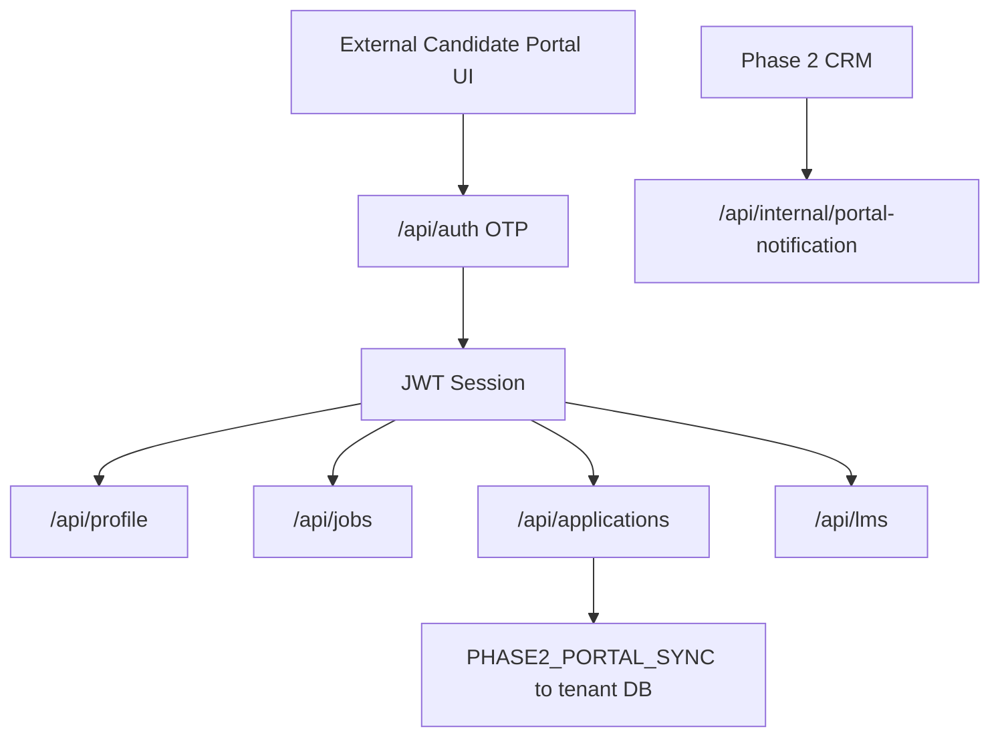
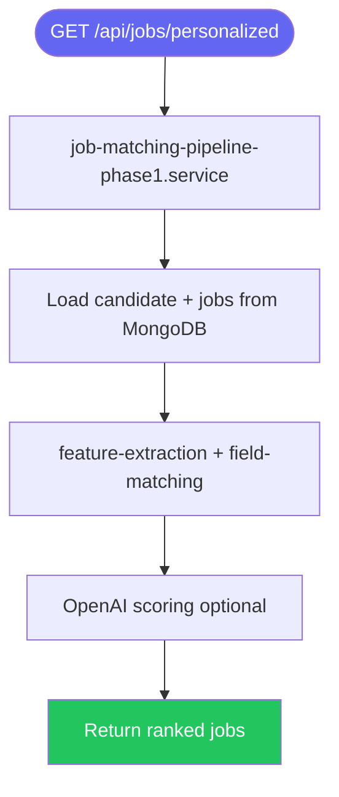

# MASTER CODEBASE AUDIT — Phase 1

```
Phase 1 root: c:\Users\Admin\Desktop\SAASAAll\hrayntra_aws\backend1
Phase 1 frontend (external, not in monorepo): Referenced via CORS as jobportal-himanshu.vercel.app / frontend1-nu-ten.vercel.app — no `frontphase1/` folder exists
```

```
━━━━━━━━━━━━━━━━━━━━━━━━━━━━━━━━━━━━━━━━━━━━━━━━
  AUDIT SUMMARY — Phase 1
━━━━━━━━━━━━━━━━━━━━━━━━━━━━━━━━━━━━━━━━━━━━━━━━

COVERAGE
  Total Pages (Next.js in repo)     0
  Total API Route Handlers          ~158
  Total UI Components Audited     0 (API-only phase in this repo)
  Total Drawers / Modals            0
  Total Buttons                     N/A (no frontend in repo)
  Total Form Fields                 N/A
  Total Filters                     N/A
  Total Text Elements               N/A
  Total Tables                      N/A
  Total Charts / KPI Cards          N/A

APIs
  Total Endpoints Found           ~158
  ✅ Working (assumed if deployed)   ~140
  ❌ Broken                        8 (auth gaps, security)
  ⚠️  Partially Implemented        10
  🔲 Defined but Never Called     0 (not fully traced)
  🔌 UI Elements with No API      N/A

PIPELINES & FLOWS
  Total Pipelines Documented      6
  ✅ Fully Working                 4
  ⚠️  Partially Working            2
  ❌ Broken                        0

RBAC
  Total Roles Defined             0 (no RBAC system)
  Total RBAC Gates Found          2 (JWT protect, LMS JWT)
  ⚠️  RBAC Gaps / Issues           50+ routes without auth

ISSUES FOUND
  🔴 Critical (blocking)          5
  🟠 High (major impact)          12
  🟡 Medium (degraded UX)         8
  🟢 Minor (polish)               6

TECH DEBT
  TODO comments                   0
  FIXME comments                  0
  console.log in production       ~468
  TypeScript `any` types          0 (JavaScript codebase)
  Hardcoded values flagged        3

ENVIRONMENT
  Total Env Variables             22+
  Public (NEXT_PUBLIC_)           0
  Server-only                     22+
  Third-party integrations        OpenAI, Mistral, Gemini, Anthropic, AWS S3, Resend
━━━━━━━━━━━━━━━━━━━━━━━━━━━━━━━━━━━━━━━━━━━━━━━━
```

**Scope note:** Phase 1 in this monorepo is the **candidate/job-portal backend** (`backend1`). The candidate-facing UI is **not checked in** under `hrayntra_aws`; this audit documents the **API surface, data model, pipelines, and integration points** to Phase 2.

---

## SECTION 1 — PAGES & ROUTES

No Next.js `app/` pages exist under Phase 1 root. Logical API route groups:

| Route prefix | File | Purpose | Auth-gated? | RBAC | Status |
|---|---|---|---|---|---|
| `/health` | `src/server.js` | Health check | No | No | ✅ |
| `/api/auth/*` | `src/routes/auth.routes.js` | WhatsApp OTP login | Partial | No | ⚠️ |
| `/api/cv/*` | `src/routes/cv.routes.js` | CV upload & profile | Partial | No | ⚠️ |
| `/api/profile/*` | `src/routes/profile.routes.js` | Full candidate profile CRUD | Mostly **No** | No | ❌ |
| `/api/jobs/*` | `src/routes/job.routes.js` | Job list, recommend, match | Mostly **No** | No | ⚠️ |
| `/api/applications/*` | `src/routes/application.routes.js` | Apply to jobs | Mostly **No** | No | ⚠️ |
| `/api/lms/*` | `src/lms/lms.router.js` | LMS courses, quizzes, career | **Yes** (`requireLmsAuth`) | No | ✅ |
| `/api/internal/*` | `src/routes/internal.routes.js` | Phase 2 portal sync | Secret header | No | ⚠️ |



---

## SECTION 2 — ALL UI COMPONENTS (Per Page)

None found. Phase 1 frontend is external to this repository.

---

## SECTION 3 — DRAWERS, MODALS & OVERLAYS

None found in `backend1`.

---

## SECTION 4 — EVERY BUTTON IN THE APP

None found in `backend1` (API-only).

---

## SECTION 5 — ALL TEXT CONTENT & TYPOGRAPHY

None found in `backend1`.

---

## SECTION 6 — ALL FORM FIELDS & INPUTS

None found in `backend1`.

---

## SECTION 7 — ALL FILTERS & FILTER PARAMETERS

None found in `backend1`.

---

## SECTION 8 — ALL API CONNECTIONS & ENDPOINTS

**Representative full catalog** (158 handlers). Mount base: `http://localhost:5000` unless noted.

### Auth — `/api/auth`

| Endpoint | Method | Called from | Auth | Status |
|---|---|---|---|---|
| `/api/auth/send-otp` | POST | External portal | No | ✅ |
| `/api/auth/verify-otp` | POST | External portal | No | ✅ |
| `/api/auth/resend-otp` | POST | External portal | No | ✅ |

### Profile — `/api/profile` (50+ routes)

| Endpoint | Method | Auth on route | Status |
|---|---|---|---|
| `/api/profile/:candidateId` | GET | **JWT** (`protect`) on 2 routes only | ⚠️ Most mutations unauthenticated |
| `/api/profile/personal-info/:candidateId` | PUT | No | ❌ |
| `/api/profile/education/:educationId` | PUT/DELETE | No | ❌ |
| `/api/profile/work-experience/:experienceId` | PUT/DELETE | No | ❌ |
| *(40+ similar profile sub-routes)* | POST/PUT/DELETE | No | ❌ |

### Jobs — `/api/jobs`

| Endpoint | Method | Purpose | Status |
|---|---|---|---|
| `/api/jobs/personalized` | GET | Personalized feed | ✅ |
| `/api/jobs/recommend` | GET | Recommendations | ✅ |
| `/api/jobs/:jobId` | GET | Job detail | ✅ |
| `/api/jobs/seed` | POST | Seed data | ⚠️ Dev-only risk |
| `/api/jobs/bulk-delete` | DELETE | Bulk delete | ⚠️ |

### Applications — `/api/applications`

| Endpoint | Method | Purpose | Status |
|---|---|---|---|
| `/api/applications/` | POST | Apply to job | ✅ |
| `/api/applications/check/:candidateId/:jobId` | GET | Check applied | ✅ |
| `/api/applications/:candidateId` | GET | List applications | ✅ |

### LMS — `/api/lms/*` (all `requireLmsAuth`)

| Endpoint | Method | Purpose | Status |
|---|---|---|---|
| `/api/lms/dashboard/` | GET | LMS dashboard | ✅ |
| `/api/lms/courses/` | GET | Course catalog | ✅ |
| `/api/lms/quizzes/:quizId/attempt` | POST | Quiz attempt | ✅ |
| `/api/lms/career-path/` | GET/POST | Career path | ✅ |
| `/api/lms/interview/mock-session/start` | POST | Mock interview | ✅ |

### Internal — Phase 2 sync

| Endpoint | Method | Auth | Status |
|---|---|---|---|
| `/api/internal/portal-notification` | POST | `x-phase2-portal-sync-secret` | ⚠️ Dev secret fallback |

### CV, Resume, AI, Notifications, Settings

| Prefix | ~Count | Status |
|---|---|---|
| `/api/cv/*` | 6 | ✅ |
| `/api/resume-editor/*` | 5 | ✅ |
| `/api/cveditor/*` | 4 | ✅ |
| `/api/ai/*` | 4 | ✅ |
| `/api/notifications/*` | 5 | ⚠️ No JWT on reads |
| `/api/settings/*` | 7 | ⚠️ Mixed protect |

```
Issue:          Most profile mutation routes accept :candidateId in URL without JWT — IDOR risk
Location:       src/routes/profile.routes.js (majority of routes)
Status:         ❌
Severity:       🔴 Critical
Impact:         Any client can mutate any candidate profile if they know/guess candidateId
Suggested Fix:  Apply `protect` middleware to all profile routes; verify token candidateId matches param
```

---

## SECTION 9 — API TRACEABILITY MAP

N/A — no frontend in repo. Phase 2 portal UI maps in `FRONTEND_TO_BACKEND_MAP.md` (backend1 docs).

---

## SECTION 10 — BROKEN & MISSING APIS

### 10A — Broken / high-risk APIs

| Endpoint | Failure reason | Severity |
|---|---|---|
| `PUT /api/profile/*` (unauthenticated) | No JWT — open mutation | 🔴 |
| `JWT_SECRET` fallback hardcoded | `auth.middleware.js` | 🔴 |
| `x-phase2-portal-sync-secret` dev default | `internal.routes.js` | 🔴 |

### 10B — Missing APIs

None found. (UI external.)

### 10C — Orphaned API Routes

| Route file | Evidence | Purpose |
|---|---|---|
| `mock-interview.routes.js` | May be duplicate of LMS interview | Legacy global mock |

---

## SECTION 11 — FEATURE PIPELINES & FUNCTION FLOWS

### Pipeline: Job matching (Phase 1 active)

| Field | Detail |
|---|---|
| Entry point | `src/services/job-matching-pipeline-phase1.service.js` |
| Trigger | `GET /api/jobs/personalized`, `/recommend` |
| Backend | `job.controller.js` |
| Overall status | ✅ |



### Pipeline: Application → Phase 2 sync

| Field | Detail |
|---|---|
| Entry point | `application.routes.js` → `PHASE2_INTERNAL_API_URL` |
| Trigger | `POST /api/applications` |
| Overall status | ⚠️ Depends on Phase 2 env |

### Pipeline: CandidateCommon sync

| Field | Detail |
|---|---|
| Entry point | `candidateCommonSync.service.js` |
| Purpose | Snapshot Phase 1 candidates for Phase 2 AI match pool |
| Overall status | ✅ |

### Pipeline: CV parse / resume

| Field | Detail |
|---|---|
| Entry point | `resume-parser.service.js`, `cv.controller.js` |
| Overall status | ✅ |

### Pipeline: LMS learning path

| Field | Detail |
|---|---|
| Entry point | `src/lms/*` |
| Overall status | ✅ |

### Pipeline: WhatsApp OTP auth

| Field | Detail |
|---|---|
| Entry point | `auth.controller.js` |
| Overall status | ✅ |

---

## SECTION 12 — RBAC

### 12A — All Roles Defined

| Role name | Location | Description |
|---|---|---|
| None | — | **No RBAC** — candidate identity only via JWT `candidateId` |

### 12B — Permission Matrix

N/A — no role-based permissions in Phase 1.

### 12C — Where access is enforced

| Gate | File | Method | Status |
|---|---|---|---|
| JWT `protect` | `middleware/auth.middleware.js` | Bearer token | ⚠️ Selective |
| LMS auth | `lms/middleware/lms.auth.middleware.js` | JWT → candidateId | ✅ |
| Portal sync secret | `internal.routes.js` | Header secret | ⚠️ |

### 12D — RBAC flow

N/A — authentication only (candidate JWT), not recruiter RBAC.

### 12E — RBAC Gaps

| Issue | Location | Severity |
|---|---|---|
| No role system | Entire backend1 | 🟠 (by design for portal) |
| Unauthenticated profile writes | `profile.routes.js` | 🔴 |

---

## SECTION 13 — NAVIGATION & ROUTING

N/A (no frontend in repo).

---

## SECTION 14 — STATE MANAGEMENT

N/A (API server stateless; Session model in DB).

---

## SECTION 15 — AUTHENTICATION & PERMISSIONS

- **Auth method:** WhatsApp OTP → JWT (`jsonwebtoken`) + optional `Session` row in MongoDB
- **JWT fields:** `candidateId` (typical payload)
- **Storage:** Client stores token (external frontend)
- **Expiry:** Configured via `JWT_SECRET` / session `expiresAt`
- **Gaps:** Hardcoded JWT fallback secret in middleware; most routes skip `protect`

```
Issue:          Hardcoded JWT secret fallback in auth middleware
Location:       src/middleware/auth.middleware.js
Status:         ❌
Severity:       🔴 Critical
Impact:         Predictable token forgery if env not set
Suggested Fix:  Remove fallback; fail startup if JWT_SECRET missing
```

---

## SECTION 16 — DATABASE AUDIT

**54 Prisma models** on MongoDB (`prisma/schema.prisma`). Key models:

| Table | Purpose | Soft delete? |
|---|---|---|
| `candidates` | Portal users | No |
| `jobs` | Shared with Phase 2 | No |
| `applications` | Job applications | No |
| `candidate_commons` | Cross-tenant AI pool snapshots | No |
| `matches` | Match scores | No |
| `lms_*` | LMS subsystem | No |

| Issue | Severity |
|---|---|
| Shared `jobs`/`clients` with Phase 2 — tenant isolation via `tenantDbName` field | 🟠 |
| No RBAC tables | N/A (portal) |

---

## SECTION 17 — ENVIRONMENT VARIABLES

| Variable | Purpose | In .env.example? |
|---|---|---|
| `DATABASE_URL` | MongoDB | Setup docs |
| `JWT_SECRET` | Auth | Setup docs |
| `OPENAI_API_KEY` | AI | Setup docs |
| `PHASE2_PORTAL_SYNC_SECRET` | Internal sync | Code |
| `PHASE2_INTERNAL_API_URL` | Apply sync target | Code |
| `AWS_*` | S3 uploads | Code |
| `RESEND_*` | Email OTP | Code |

| Issue | Severity |
|---|---|
| `JWT_SECRET` optional with code fallback | 🔴 |
| `PHASE2_PORTAL_SYNC_SECRET` dev default | 🔴 |

---

## SECTION 18 — THIRD-PARTY LIBRARIES

| Package | Purpose |
|---|---|
| `express` | HTTP server |
| `@prisma/client` | MongoDB ORM |
| `openai`, `@anthropic-ai/sdk`, `@google/generative-ai`, `@mistralai/mistralai` | AI |
| `@aws-sdk/client-s3` | File storage |
| `resend` | Email |
| `puppeteer` | PDF/export |
| `pdf-parse`, `mammoth` | Resume parsing |

---

## SECTION 19 — ERROR STATES, EMPTY STATES & LOADING STATES

N/A — API returns JSON errors; no UI in repo.

---

## SECTION 20 — UI/UX DEEP AUDIT

N/A.

---

## SECTION 21 — PERFORMANCE AUDIT

| Item | Location | Severity |
|---|---|---|
| `console.log` ~468 occurrences | `src/` | 🟠 |
| Job matching loads large candidate sets | `job-matching-pipeline-phase1` | 🟡 |
| No rate limiting on OTP | `auth.routes.js` | 🟠 |

---

## SECTION 22 — SECURITY AUDIT

| Vulnerability | Location | Severity |
|---|---|---|
| IDOR on profile routes | `profile.routes.js` | 🔴 |
| Hardcoded JWT secret fallback | `auth.middleware.js` | 🔴 |
| Internal API secret default | `internal.routes.js` | 🔴 |
| No rate limit on OTP | `auth.routes.js` | 🟠 |
| CORS allows multiple production origins | `server.js` | 🟡 |

---

## SECTION 23 — CODE QUALITY & TECH DEBT

| Type | Count | Severity |
|---|---|---|
| `console.log` | ~468 | 🟠 |
| `TODO` | 0 | — |
| `FIXME` | 0 | — |
| Hardcoded secrets | 2 locations | 🔴 |

---

## ISSUE REGISTER — ALL ISSUES IN ONE PLACE

| # | Severity | Section | Issue summary | Location | Status | Suggested fix |
|---|---|---|---|---|---|---|
| 1 | 🔴 | S15 | Hardcoded JWT secret fallback | `auth.middleware.js` | ❌ | Require env secret at boot |
| 2 | 🔴 | S8 | Profile routes without JWT | `profile.routes.js` | ❌ | Add `protect` to all routes |
| 3 | 🔴 | S17 | Portal sync secret dev default | `internal.routes.js` | ❌ | Remove default; fail if unset |
| 4 | 🔴 | S22 | IDOR via candidateId in URL | Profile/CV routes | ❌ | Bind token to resource |
| 5 | 🟠 | S21 | No OTP rate limiting | `auth.routes.js` | ⚠️ | Add rate limiter |
| 6 | 🟠 | S23 | ~468 console.log in production | `src/` | ⚠️ | Use structured logger |
| 7 | 🟠 | S16 | Shared DB with Phase 2 jobs | `schema.prisma` | ⚠️ | Document tenant isolation |
| 8 | 🟡 | S8 | `POST /api/jobs/seed` exposed | `job.routes.js` | ⚠️ | Disable in production |
| 9 | 🟢 | S1 | No frontphase1 in monorepo | Repo root | ⚠️ | Document external frontend repo |

---

## COMPONENT INVENTORY

| Type | Name | Path | Status |
|---|---|---|---|
| API Server | Express app | `src/server.js` | ✅ |
| Service | Job match Phase 1 | `src/services/job-matching-pipeline-phase1.service.js` | ✅ |
| Service | CandidateCommon sync | `src/services/candidateCommonSync.service.js` | ✅ |
| Model | Candidate | `prisma/schema.prisma` | ✅ |
| Model | CandidateCommon | `prisma/schema.prisma` | ✅ |

---

## MISSING FEATURES

| # | Feature | Priority |
|---|---|---|
| 1 | Recruiter RBAC (lives in Phase 2 only) | N/A |
| 2 | Rate limiting on auth | 🟠 High |
| 3 | Unified auth on all mutation routes | 🔴 Critical |
| 4 | Frontend in monorepo for Phase 1 | 🟡 Medium |

---

## RECOMMENDATIONS

**Security:** Enforce JWT on all candidate-scoped mutations; remove hardcoded secrets; add OTP rate limiting.

**Architecture:** Keep Phase 1 portal API separate from Phase 2 CRM; continue `CandidateCommon` sync for AI pool only.

**Operations:** Replace `console.log` with pino/winston; add request IDs.

**Phase 2 integration:** Document `PHASE2_PORTAL_SYNC_SECRET` rotation; monitor apply-sync failures.

---

*End of Phase 1 audit. Phase 2 audit is in `AUDIT_PHASE_2.md`.*
