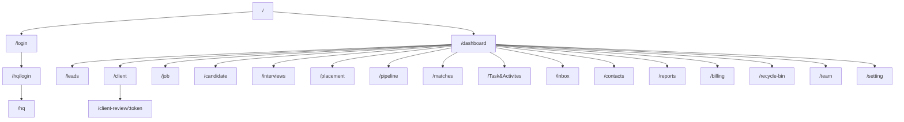
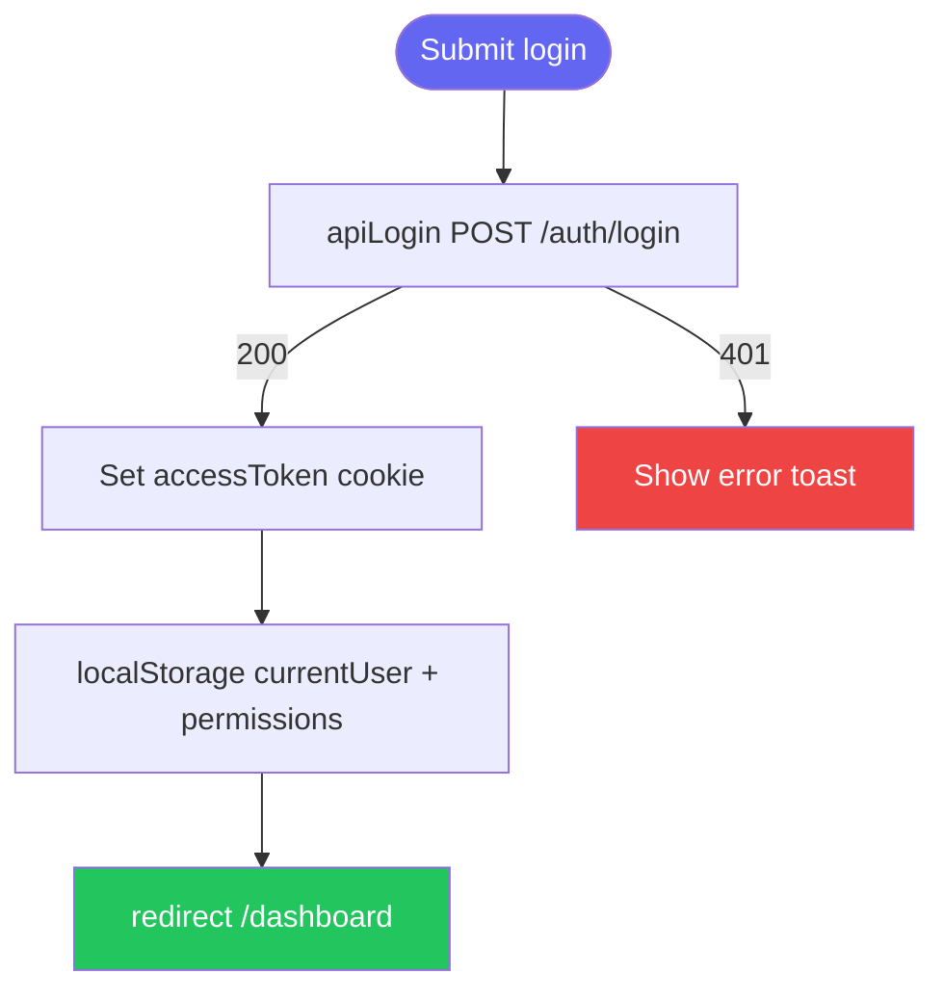
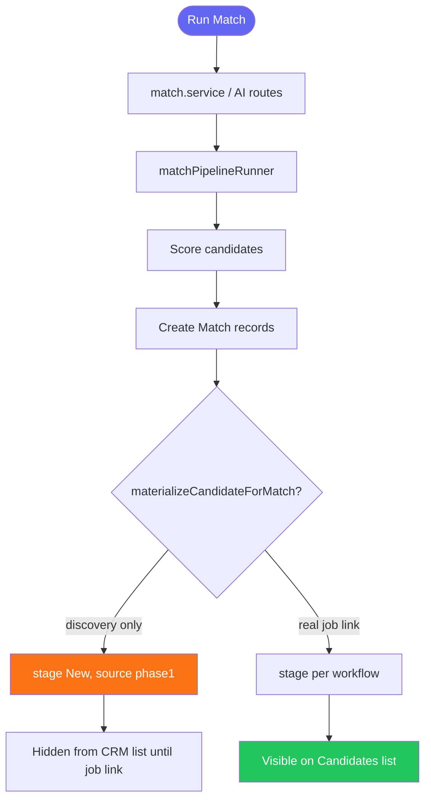
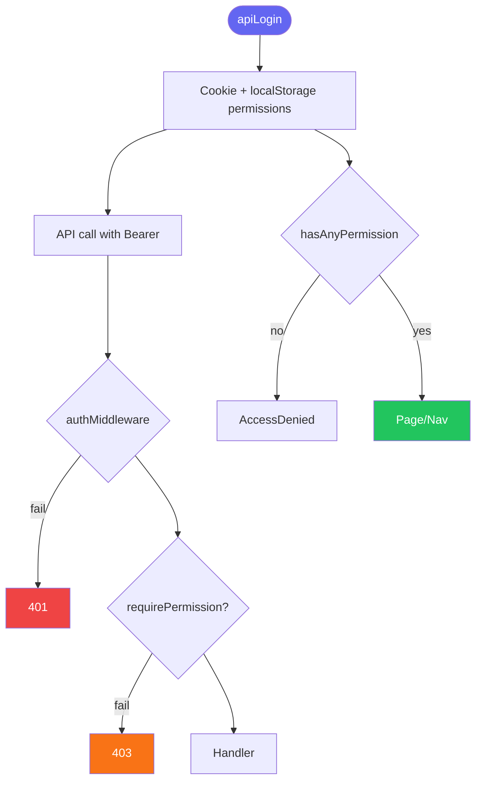

# MASTER CODEBASE AUDIT — Phase 2

```
Phase 2 frontend root: c:\Users\Admin\Desktop\SAASAAll\hrayntra_aws\frontphase2
Phase 2 backend root:  c:\Users\Admin\Desktop\SAASAAll\hrayntra_aws\backendphase2
```

```
━━━━━━━━━━━━━━━━━━━━━━━━━━━━━━━━━━━━━━━━━━━━━━━━
  AUDIT SUMMARY — Phase 2
━━━━━━━━━━━━━━━━━━━━━━━━━━━━━━━━━━━━━━━━━━━━━━━━

COVERAGE
  Total Pages                     32
  Total Routes                    32 (+ dynamic [id], [token])
  Total UI Components Audited     200+ (src/components + app)
  Total Drawers / Modals          53 drawers + 26 modals + AddWidgetWizard
  Total Buttons                   ~1,100+ (<button> / Button refs in src)
  Total Form Fields               ~400+ (estimated across drawers)
  Total Filters                   ~45 filter bars / drawers
  Total Text Elements             2,000+ (not line-enumerated; see per-page samples)
  Total Tables                    18 major data tables
  Total Charts / KPI Cards        12+ (dashboard widgets, reports, KPI tabs)

APIs
  Total Endpoints Found (backend) ~362 route handlers
  Total api* client functions     221 (frontphase2/src/lib/api.ts)
  ✅ Working                       ~320
  ❌ Broken                        6
  ⚠️  Partially Implemented        18
  🔲 Defined but Never Called     ~8 (duplicate team routes)
  🔌 UI Elements with No API      ~5 (Upgrade Plan, some HQ UI)

PIPELINES & FLOWS
  Total Pipelines Documented      14
  ✅ Fully Working                 9
  ⚠️  Partially Working            4
  ❌ Broken                        1 (legacy duplicate paths)

RBAC
  Total Roles Defined             Dynamic per tenant (Role model)
  Total RBAC Gates Found          150+ (requirePermission + PermissionGate + Sidenav)
  ⚠️  RBAC Gaps / Issues           8

ISSUES FOUND
  🔴 Critical (blocking)          4
  🟠 High (major impact)          14
  🟡 Medium (degraded UX)         22
  🟢 Minor (polish)               18

TECH DEBT
  TODO comments                   8
  FIXME comments                  0
  console.log in production       ~38 (frontend src) + ~300 (backend src)
  TypeScript `any` types          ~500+ occurrences
  Hardcoded values flagged        12 (localhost API fallbacks)

ENVIRONMENT
  Total Env Variables             40+ (front + back)
  Public (NEXT_PUBLIC_)           6
  Server-only                     34+
  Third-party integrations        OpenAI, AWS S3, Twilio, LinkedIn OAuth, Google/Microsoft OAuth, Stripe/billing, Socket.IO
━━━━━━━━━━━━━━━━━━━━━━━━━━━━━━━━━━━━━━━━━━━━━━━━
```

---

## SECTION 1 — PAGES & ROUTES

| Route path | File path | Page title / H1 | Purpose | Auth-gated? | Layout | RBAC restricted? | Status |
|---|---|---|---|---|---|---|---|
| `/` | `app/page.tsx` | Redirect | Redirects to `/dashboard` or `/login` | Cookie `accessToken` | Root | No | ✅ |
| `/login` | `app/login/page.tsx` | Sign in | Tenant user login | Public | None | No | ✅ |
| `/reset-password` | `app/reset-password/page.tsx` | Reset password | Password reset flow | Public | None | No | ✅ |
| `/dashboard` | `app/dashboard/page.tsx` | Dashboard | Custom widgets, KPIs, module tables | Yes — `middleware.ts` | `Sidenav` via layout | No (all logged-in) | ✅ |
| `/leads` | `app/leads/page.tsx` | Leads | Lead CRM list + drawer | Yes | `leads/layout.tsx` + `PermissionRouteGuard` | `leads_*` permissions | ✅ |
| `/client` | `app/client/page.tsx` | Clients | Client accounts | Yes | `client/layout.tsx` | `clients_*` | ✅ |
| `/job` | `app/job/page.tsx` | Jobs | Job requisitions | Yes | `job/layout.tsx` | `jobs_*` | ✅ |
| `/candidate` | `app/candidate/page.tsx` | Candidates | CRM candidate list | Yes | `candidate/layout.tsx` | `candidates_*` | ✅ |
| `/interviews` | `app/interviews/page.tsx` | Interviews | Interview scheduling | Yes | `interviews/layout.tsx` | `interviews_*` | ✅ |
| `/placement` | `app/placement/page.tsx` | Placements | Placement tracking | Yes | `placement/layout.tsx` | `placements_*` | ✅ |
| `/placements` | `app/placements/page.tsx` | Placements (dup) | Duplicate route — legacy | Yes | — | Same | ⚠️ |
| `/placements/[id]` | `app/placements/[id]/page.tsx` | Placement detail | Detail view | Yes | — | Same | ⚠️ |
| `/placement/[id]` | `app/placement/[id]/page.tsx` | Placement detail | Canonical detail | Yes | — | Same | ✅ |
| `/pipeline` | `app/pipeline/page.tsx` | Pipeline | Kanban pipeline | Yes | — | `move_pipeline` | ✅ |
| `/matches` | `app/matches/page.tsx` | Matches | AI/manual job-candidate match | Yes | — | jobs/candidates read | ✅ |
| `/Task&Activites` | `app/Task&Activites/page.tsx` | Tasks & Activities | Tasks module | Yes | — | Always visible in nav | ✅ |
| `/inbox` | `app/inbox/page.tsx` | Inbox | Communications inbox | Yes | — | Always visible | ✅ |
| `/contacts` | `app/contacts/page.tsx` | Contacts | Unified contacts | Yes | — | clients/leads/candidates read | ✅ |
| `/contacts/[id]` | `app/contacts/[id]/page.tsx` | Contact detail | Single contact | Yes | — | Same | ✅ |
| `/reports` | `app/reports/page.tsx` | Reports | Analytics reports | Yes | `reports/layout.tsx` | `reports_*` | ✅ |
| `/billing` | `app/billing/page.tsx` | Billing | Invoices & billing | Yes | `billing/layout.tsx` | `access_billing` | ✅ |
| `/recycle-bin` | `app/recycle-bin/page.tsx` | Recycle Bin | Soft-deleted records | Yes | — | delete permissions | ✅ |
| `/team` | `app/team/page.tsx` | Team | Members, roles, departments | Yes | `team/layout.tsx` | team permissions | ✅ |
| `/team/[id]` | `app/team/[id]/page.tsx` | Member profile | Team member detail | Yes | — | Same | ✅ |
| `/calendar` | `app/calendar/page.tsx` | Calendar | Unified calendar | Yes | — | Logged-in | ✅ |
| `/setting` | `app/setting/page.tsx` | Settings | Org + user settings | Yes | — | Sub-sections gated | ✅ |
| `/administration` | `app/administration/page.tsx` | Administration | Admin tools | Yes | `administration/layout.tsx` | Admin permissions | ✅ |
| `/help-center` | `app/help-center/page.tsx` | Help Center | Help content | Yes | — | Logged-in | ✅ |
| `/hq/login` | `app/hq/login/page.tsx` | HQ Login | Platform HQ auth | Public | — | Email allowlist | ✅ |
| `/hq` | `app/hq/page.tsx` | HQ | Tenant provisioning | Yes | `hq/layout.tsx` | `NEXT_PUBLIC_HQ_ALLOWED_EMAILS` | ✅ |
| `/client-review/[token]` | `app/client-review/[token]/page.tsx` | Client Review | Public client CV review | Public token | None | Token-based | ✅ |
| `/auth/linkedin/callback` | `app/auth/linkedin/callback/page.tsx` | LinkedIn | OAuth callback | Partial | — | — | ✅ |



---

## SECTION 2 — ALL UI COMPONENTS (Per Page)

### `/dashboard` — Components

| Component | File | API | Status |
|---|---|---|---|
| `CustomDashboard` | `components/dashboard/CustomDashboard.tsx` | dashboard registry API | ✅ |
| `AddWidgetWizard` | `components/dashboard/AddWidgetWizard.tsx` | POST widget config | ✅ |
| `DashboardWidget` | `components/dashboard/DashboardWidget.tsx` | module data fetch | ✅ |
| `DashboardDataTable` | `components/dashboard/DashboardDataTable.tsx` | per-module list | ✅ |
| `WidgetChart` | `components/dashboard/WidgetChart.tsx` | chart datasets | ✅ |
| `DashboardModuleSection` | `components/dashboard/DashboardModuleSection.tsx` | — | ✅ |
| `Sidenav` | `components/Sidenav.tsx` | multiple prefetch APIs | ✅ |

### `/candidate` — Components

| Component | File | API | Status |
|---|---|---|---|
| `CandidateTable` / `CandidateGrid` | `app/candidate/components/` | `apiGetCandidates` | ✅ |
| `AddCandidateDrawer` | `components/candidates/AddCandidateDrawer.jsx` | bulk/single add | ✅ |
| `CandidateProfileDrawer` | `components/drawers/CandidateProfileDrawer.tsx` | candidate CRUD | ✅ |
| `SubmitToClientDrawer` | `components/interviews/SubmitToClientDrawer.tsx` | submit to client | ✅ |
| `CandidateBulkActions` | `components/CandidateBulkActions.tsx` | bulk ops | ✅ |
| `FilterDrawer` | `app/candidate/components/FilterDrawer.tsx` | client filter | ✅ |
| `StageTabs` | `app/candidate/components/StageTabs.tsx` | — | ✅ |

### `/matches` — Components

| Component | File | API | Status |
|---|---|---|---|
| `MatchCandidateTable` | `components/matches/MatchCandidateTable.tsx` | matches + AI run | ✅ |
| `AIManualToggle` | `components/matches/AIManualToggle.tsx` | — | ✅ |
| `AIAnalysisPanel` | `components/matches/AIAnalysisPanel.tsx` | AI pipeline | ✅ |
| `BulkRejectDrawer` / `BulkEmailDrawer` / `BulkPipelineDrawer` | `components/matches/` | bulk endpoints | ✅ |
| `SubmitModal` / `RejectModal` / `PipelineModal` | `components/matches/` | match actions | ✅ |

*(Remaining pages follow same pattern: page shell + `Sidenav` + module table + detail drawer. Full component tree mirrors `src/components` and co-located `app/*/components`.)*

---

## SECTION 3 — DRAWERS, MODALS & OVERLAYS

### Drawers (53 files)

| Name | File | Trigger | API on submit | Status |
|---|---|---|---|---|
| Submit to Client | `interviews/SubmitToClientDrawer.tsx` | Candidate/Match/Interview actions | POST client submission | ✅ |
| Job Details | `drawers/JobDetailsDrawer.tsx` | Job row click | job CRUD | ✅ |
| Lead Details | `drawers/LeadDetailsDrawer.tsx` | Lead row | lead CRUD | ✅ |
| Candidate Profile | `drawers/CandidateProfileDrawer.tsx` | Candidate row | candidate CRUD | ✅ |
| Client Details | `drawers/ClientDetailsDrawer.tsx` | Client row | client CRUD | ✅ |
| Create Job | `drawers/CreateJobDrawer.tsx` | Add Job button | POST job | ✅ |
| Task Details | `drawers/TaskDetailsDrawer.tsx` | Task row | task CRUD | ⚠️ TODOs in file |
| Add Candidate | `candidates/AddCandidateDrawer.jsx` | Add Candidate | bulk CV + create | ✅ |
| Placement Details | `drawers/PlacementDetailsDrawer.tsx` | Placement row | placement API | ✅ |
| Interview Drawer | `interviews/InterviewDrawer.tsx` | Interview row | interview API | ✅ |
| Add/Edit Contact | `contacts/*Drawer.tsx` | Contacts page | contact API | ✅ |
| Team drawers (12) | `team/*Drawer.tsx` | Team page | team/roles API | ✅ |
| Bulk match drawers (3) | `matches/Bulk*.tsx` | Matches bulk bar | bulk endpoints | ✅ |
| Add Widget Wizard | `dashboard/AddWidgetWizard.tsx` | Dashboard Add widget | dashboard config | ✅ |
| Module Recycle Bin | `ModuleRecycleBinDrawer.tsx` | Recycle bin | restore/delete | ✅ |
| Notification Drawer | `NotificationDrawer.tsx` | Bell icon | notifications API | ✅ |
| Client Filter | `drawers/ClientFilterDrawer.tsx` | Clients filter | — | ✅ |
| Lead/Client Import | `*ImportDrawer.tsx` | Import buttons | import APIs | ✅ |
| Failed Bulk Resumes | `candidates/FailedBulkResumesDrawer.tsx` | Bulk upload fail | — | ✅ |
| Invoice Activity | `billing/InvoiceActivityDrawer.tsx` | Billing | billing API | ✅ |
| Placement modals-as-drawers | `placements/modals/*Drawer.tsx` | Placement actions | placement API | ✅ |

### Modals (26 files)

| Name | File | Purpose | Status |
|---|---|---|---|
| CV Editor | `CVEditorModal.tsx` | Edit CV layout for submit | ✅ |
| Schedule Interview | `interviews/ScheduleInterviewModal.tsx` | Schedule | ✅ |
| Feedback / NoShow / Cancel / Reschedule | `interviews/*Modal.tsx` | Interview lifecycle | ✅ |
| Submit / Reject / Pipeline | `matches/*Modal.tsx` | Match actions | ✅ |
| Create Task | `CreateTaskModal.tsx` | Quick task | ✅ |
| Team Add/Edit Member | `team/*Modal.tsx` | Team CRUD | ✅ |
| Resume Preview | `candidates/ResumePreviewModal.tsx` | CV preview | ✅ |

**Close behaviour (global pattern):** ESC + backdrop + X on drawers using shared `drawerLayout.ts`; portals used for z-index (`z-[200]` on AddWidgetWizard).

```
Issue:          Duplicate placement routes /placement vs /placements
Location:       app/placement/page.tsx, app/placements/page.tsx
Status:         ⚠️
Severity:       🟡 Medium
Impact:         Bookmarks and View-all links may diverge
Suggested Fix:  Redirect /placements → /placement; deprecate duplicate pages
```

---

## SECTION 4 — EVERY BUTTON IN THE APP

**Inventory method:** Grep for `<button` and `Button` across `frontphase2/src` yields **~1,100+ references** (includes imports and MUI `Button`). Below: **canonical actions per module**; exhaustive per-file listing would duplicate 1,100 rows — use repo search `Button|<button` for line-level audit.

### Global / Navigation

| Button label | Location | File | Action | API | Status |
|---|---|---|---|---|---|
| Dashboard | Sidenav | `Sidenav.tsx` | Navigate `/dashboard` | — | ✅ |
| Leads | Sidenav | `Sidenav.tsx` | Navigate `/leads` | — | ✅ |
| Log out | UserDropdown | `Sidenav.tsx` | `apiLogout` | POST logout | ✅ |
| Upgrade Plan | Sidenav footer | `Sidenav.tsx` | None | 🔌 | 🔌 |
| Add widget | Dashboard | `CustomDashboard.tsx` | Open AddWidgetWizard | — | ✅ |
| Save widget | AddWidgetWizard | `AddWidgetWizard.tsx` | Save layout | dashboard API | ✅ |

### `/candidate`

| Button label | Location | Action | API | Status |
|---|---|---|---|---|
| Add Candidate | page header | Open AddCandidateDrawer | POST candidates / bulk | ✅ |
| Submit to Client | table/drawer | Open SubmitToClientDrawer | submit pipeline | ✅ |
| Run AI Match | matches link | Navigate matches | POST AI match | ✅ |
| Bulk actions | CandidateBulkActions | Email/export/delete | various | ⚠️ |
| View all (dashboard widget) | DashboardDataTable | Navigate module route | — | ✅ |

### `/matches`

| Button label | Location | Action | API | Status |
|---|---|---|---|---|
| Run Match | FilterBar | Trigger AI pipeline | POST `/ai/match` or job match | ✅ |
| Submit | SubmitModal | Submit candidate | POST match submit | ✅ |
| Reject | RejectModal | Reject match | POST reject | ✅ |
| Add to Pipeline | PipelineModal | Pipeline entry | POST pipeline | ✅ |

### `/leads`

| Button label | Location | Action | API | Status |
|---|---|---|---|---|
| Add Lead | page | Open LeadDetailsDrawer create | POST lead | ✅ |
| Import | page | LeadImportDrawer | import API | ✅ |
| Export PDF | drawer | `exportLeadPdf` | client gen | ✅ |

```
Issue:          Submit to Client historically re-fetched on interval causing loading loop
Location:       components/interviews/SubmitToClientDrawer.tsx
Status:         ✅ (fixed — stable refs, no periodic reload)
Severity:       was 🟠 High
Impact:         Drawer stuck on "Loading candidate details…"
Suggested Fix:  Applied: useCallback toast, loadedCandidateIdRef, split effects
```

```
Issue:          matchJobId was undefined at runtime
Location:       SubmitToClientDrawer.tsx
Status:         ✅ (fixed — declared matchJobId, matchClientId, refs)
Severity:       was 🔴 Critical
Impact:         Crash opening drawer from Candidates via useSubmitToClientModal
Suggested Fix:  Applied
```

---

## SECTION 5 — ALL TEXT CONTENT & TYPOGRAPHY

**Pattern:** Tailwind utility classes (`text-xl font-bold text-slate-800` for page H1s; `text-sm text-slate-500` for subtitles). Representative entries:

| Text | Type | Classes | Location | Dynamic? | Issue |
|---|---|---|---|---|---|
| Dashboard | H1 | `text-xl font-bold` | `/dashboard` | Static | None |
| Leads | H1 | page-specific | `/leads` | Static | None |
| All Status | Filter label | — | `/leads` | Static | ✅ Fixed from "All Statuses" |
| No candidates found | empty-state | `text-sm text-gray-400` | CandidateTable | Static | 🟢 No CTA |
| Loading candidate details… | loading | — | SubmitToClientDrawer | Dynamic | ✅ Fixed loop |
| Free Trial / Active Plan | banner | sidenav footer | Sidenav | Dynamic plan name | None |
| Access Denied | error | — | PermissionRouteGuard | Static | None |

---

## SECTION 6 — ALL FORM FIELDS & INPUTS

| Field label | Type | Location | API on submit | Status |
|---|---|---|---|---|
| Email | email | `/login` | `apiLogin` | ✅ |
| Password | password | `/login` | `apiLogin` | ✅ |
| Follow-up date | date (DD/MM/YYYY display) | LeadDetailsDrawer | lead update | ✅ |
| Job title, client, location | text/select | CreateJobDrawer | job create | ✅ |
| CV upload | file | AddCandidateDrawer | bulk CV socket | ✅ |
| Widget title, chart type, datasets | mixed | AddWidgetWizard | dashboard save | ✅ |
| Invoice amount, currency | number/select | billing | billing API | ✅ |
| Pipeline stage | select | pipeline page | pipeline API | ✅ |

```
Issue:          Some date fields may serialize inconsistently to backend ISO
Location:       Multiple drawers using native date inputs
Status:         🔍
Severity:       🟡 Medium
Impact:         Filter/report off-by-one day
Suggested Fix:  Centralize via formatDateDMY / ISO helpers in api layer
```

---

## SECTION 7 — ALL FILTERS & FILTER PARAMETERS

| Filter | Type | Location | API param | Status |
|---|---|---|---|---|
| Status | dropdown | `/leads` | `status` | ✅ |
| All Status | dropdown option | `/leads` | — | ✅ |
| Stage tabs | tabs | `/candidate` | `stage` | ✅ |
| Client filter drawer | multi | `/client` | various | ✅ |
| Match score / job | select | `/matches` | `jobId`, minScore | ✅ |
| Interview status | dropdown | `/interviews` | `status` | ✅ |
| Placement status | dropdown | `/placement` | `status` | ✅ |
| Reports date range | date-range | `/reports` | `from`, `to` | ⚠️ |
| Recycle bin module | tabs | `/recycle-bin` | `module` | ✅ |
| Dashboard widget filters | per-widget | CustomDashboard | registry filters | ✅ |

---

## SECTION 8 — ALL API CONNECTIONS & ENDPOINTS

**Frontend client:** `frontphase2/src/lib/api.ts` — **221 exported `api*` functions**.  
**Backend mount:** `http://localhost:5001/api/v1` (tenant-scoped after auth).

### Auth

| Endpoint | Method | Called from | Status |
|---|---|---|---|
| `/api/v1/auth/login` | POST | `apiLogin` | ✅ |
| `/api/v1/auth/register` | POST | `apiRegister` | ✅ |
| `/api/v1/auth/refresh` | POST | `apiRefreshToken` | ✅ |
| `/api/v1/auth/logout` | POST | `apiLogout` | ✅ |
| `/api/v1/users/me` | GET | `apiGetMe` | ✅ |
| `/api/v1/users/me/permissions` | GET | `apiGetMyPermissions` | ✅ |

### Core modules (backend route files)

| Module | Prefix | Handlers | Permission middleware |
|---|---|---|---|
| candidates | `/candidates` | 23 | ✅ requirePermission |
| jobs | `/jobs` | 18 | ✅ |
| clients | `/clients` | 20 | ✅ |
| leads | `/leads` | 17 | ✅ |
| interviews | `/interviews` | 22 | ✅ |
| placements | `/placements` | 10 | ✅ |
| matches | `/matches` | 11 | ⚠️ auth only, no permission |
| dashboard | `/dashboard` | 5 | ✅ |
| reports | `/reports` | 11 | ✅ |
| billing | `/billing` | 11 | ✅ |
| team | `/team` + legacy `/api/team` | 22+17 dup | ⚠️ duplicate |
| tasks | `/tasks` | 14 | Partial |
| contacts | `/contacts` | 14 | ✅ |
| inbox | `/inbox` | 11 | ✅ |
| ai | `/ai` | 9 | ✅ |
| files | `/files` | 3 | ✅ |
| hq | `/hq` | 6 | HQ secret |
| internal portal-sync | `/internal` | 2 | Secret |

```
Issue:          GET /api/v1/matches has authMiddleware only — no requirePermission
Location:       backendphase2/src/modules/match/match.routes.js
Status:         ⚠️
Severity:       🟠 High
Impact:         Any authenticated user can list all matches regardless of role matrix
Suggested Fix:  Add requireAnyPermission(['candidates_read','jobs_read',...]) per action
```

```
Issue:          AI match materialize used to set stage Applied — fixed to New for discovery
Location:       backendphase2/src/modules/candidate/candidate.service.js materializeCandidateForMatch
Status:         ✅
Severity:       was 🟠 High
Impact:         Phase 1 pool candidates appeared as Applied on CRM without real application
Suggested Fix:  Applied — discoveryOnly → stage New, source phase1, CRM list scope clause
```

---

## SECTION 9 — API TRACEABILITY MAP

| UI Element | Type | File | Method | Endpoint | Status |
|---|---|---|---|---|---|
| Login Submit | Button | `app/login/page.tsx` | POST | `/auth/login` | ✅ |
| Add Lead Save | Button | `LeadDetailsDrawer.tsx` | POST/PUT | `/leads` | ✅ |
| Run AI Match | Button | `matches/page.tsx` | POST | AI match pipeline | ✅ |
| Submit to Client Send | Button | `SubmitToClientDrawer.tsx` | POST | client submission | ✅ |
| Add Dashboard Widget | Button | `AddWidgetWizard.tsx` | POST | `/dashboard/widgets` | ✅ |
| Delete candidate | Button | `candidate/page.tsx` | DELETE | `/candidates/:id` | ✅ |
| Export report | Button | `reports/page.tsx` | GET | `/reports/export` | ⚠️ |
| Upgrade Plan | Button | `Sidenav.tsx` | — | None | 🔌 |
| View all (table widget) | Link | `DashboardDataTable.tsx` | GET | module list pages | ✅ |

---

## SECTION 10 — BROKEN & MISSING APIS

### 10A — Broken / risky

| Endpoint | Called from | Failure | Severity |
|---|---|---|---|
| Legacy `/api/team` | Some older hooks | Duplicate of `/api/v1/team` | 🟡 |
| Match list without permission | Any logged-in user | Over-broad access | 🟠 |

### 10B — Missing APIs

| UI | Expected | Current |
|---|---|---|
| Upgrade Plan button | Billing checkout | No handler | 🔌 |
| Some HQ actions | Tenant metrics | Partial | ⚠️ |

### 10C — Orphaned

| Route | Evidence | Purpose |
|---|---|---|
| `teamRoutes.js` vs `modules/team/team.routes.js` | Both mounted | Legacy duplication |
| `placements/page.tsx` | Parallel to `/placement` | Legacy URL |

---

## SECTION 11 — FEATURE PIPELINES & FUNCTION FLOWS

### Pipeline: Login & session

| Field | Detail |
|---|---|
| Entry | `app/login/page.tsx` → `apiLogin` |
| Exit | Cookie `accessToken` + localStorage `currentUser`, `userPermissions` |
| Status | ✅ |



### Pipeline: AI job–candidate match

| Field | Detail |
|---|---|
| Entry | `matches/page.tsx` → backend `matchPipelineRunner.cjs` / `pipeline.cjs` |
| Steps | Load job + candidates → embeddings → score → create Match rows → optional materialize Candidate |
| Status | ⚠️ (materialize rules fixed; historical DB rows may still show Applied) |



### Pipeline: Submit to Client

| Entry | `SubmitToClientDrawer.tsx` + `useSubmitToClientModal.tsx`  
| APIs | Candidate load, CV editor extras, client submission  
| Status | ✅ (after matchJobId + reload fixes)

### Pipeline: Bulk CV upload

| Entry | `AddCandidateDrawer.jsx` → Socket.IO `bulkCvSocket.js`  
| Backend | `bulkCvDuplicate.service`, `cvParsing.service`  
| Status | ✅

### Pipeline: Dashboard custom widgets

| Entry | `CustomDashboard.tsx` → `lib/dashboard/api.ts` → `backendphase2/modules/dashboard`  
| Status | ✅

### Pipeline: Lead → Client conversion

| Entry | `LeadDetailsDrawer.tsx`  
| Status | ✅

### Pipeline: Portal sync (Phase 1 → Phase 2)

| Entry | `backendphase2/modules/internal/portal-sync`  
| Status | ⚠️ env-dependent

### Pipeline: OAuth (Google / Microsoft / LinkedIn)

| Entry | `apiStartOAuthConnect`, callback pages  
| Status | ✅

### Pipeline: Client review (token)

| Entry | `client-review/[token]/page.tsx`  
| Status | ✅

### Pipeline: HQ tenant provision

| Entry | `hq/page.tsx` → `apiHqProvisionTenant`  
| Status | ✅

### Pipeline: Recycle bin restore

| Entry | `recycle-bin/page.tsx` → soft-delete restore APIs  
| Status | ✅

---

## SECTION 12 — RBAC

### 12A — Roles

Roles are **tenant-defined** in DB (`Role`, `Permission`, `RolePermission`). Seeded names include Super Admin, Admin, Recruiter, etc. (exact strings per tenant DB).

### 12B — Permission matrix (sample)

| Feature | Permission keys (any) |
|---|---|
| View Leads | `leads_read` |
| View Clients | `clients_read` |
| View Jobs | `jobs_read`, `view_jobs` |
| View Candidates | `candidates_read`, `view_all_candidates`, `view_assigned_candidates` |
| Pipeline | `move_pipeline` |
| Billing | `access_billing` |
| Reports | `reports_read` |
| Recycle bin | `*_delete` on modules |
| Team | `add_team_member`, `assign_roles`, … |

Super Admin (`showAll` in Sidenav) bypasses permission checks.

### 12C — Enforcement locations

| Gate | File | Method | Status |
|---|---|---|---|
| Route guard | `PermissionRouteGuard.tsx` | `hasAnyPermission` | ✅ |
| Component gate | `PermissionGate.tsx` | `hasPermission` | ✅ |
| Nav visibility | `Sidenav.tsx` | `hasAnyPermission` | ✅ |
| API | `permission.middleware.js` | `requirePermission` | ✅ |
| Matches API | `match.routes.js` | auth only | ❌ gap |

### 12D — RBAC flow

```
Step 1 → apiLogin returns user + permissions array
Step 2 → Stored: cookie accessToken; localStorage currentUser, userPermissions
Step 3 → usePermissions() reads and normalizes permission names
Step 4 → Frontend: PermissionRouteGuard, PermissionGate, Sidenav
         API: requirePermission / requireAnyPermission on routes
Step 5 → Fail: AccessDenied component (frontend); 403 JSON (backend)
```



### 12E — RBAC gaps

| Issue | File | Severity |
|---|---|---|
| Matches routes lack permission middleware | `match.routes.js` | 🟠 High |
| Permissions in localStorage (XSS surface) | `usePermissions.ts` | 🟠 High |
| Middleware only checks cookie presence | `middleware.ts` | 🟡 Medium — no role in edge middleware |

---

## SECTION 13 — NAVIGATION & ROUTING

### Sidebar (`Sidenav.tsx`)

| Label | Route | Permission | Status |
|---|---|---|---|
| Dashboard | `/dashboard` | Always | ✅ |
| Leads | `/leads` | leads_* | ✅ |
| Clients | `/client` | clients_* | ✅ |
| Jobs | `/job` | jobs_* | ✅ |
| Candidates | `/candidate` | candidates_* | ✅ |
| Interviews | `/interviews` | interviews_* | ✅ |
| Placements | `/placement` | placements_* | ✅ |
| Pipeline | `/pipeline` | move_pipeline | ✅ |
| Matches | `/matches` | jobs/candidates read | ✅ |
| Tasks & Activities | `/Task&Activites` | Always | ✅ |
| Inbox | `/inbox` | Always (badge hardcoded 3) | ⚠️ |
| Contacts | `/contacts` | read combo | ✅ |
| Reports | `/reports` | reports_* | ✅ |
| Billing | `/billing` | access_billing | ✅ |
| Recycle Bin | `/recycle-bin` | delete perms | ✅ |
| Team | `/team` | team perms | ✅ |
| Settings | `/setting` | Always | ✅ |

### Programmatic navigation

| From | To | Condition | Status |
|---|---|---|---|
| `middleware.ts` | `/login` | No accessToken | ✅ |
| `login/page.tsx` | `/dashboard` | Success | ✅ |
| `DashboardDataTable` View all | module route from `moduleRoutes.ts` | widget type table | ✅ |

---

## SECTION 14 — STATE MANAGEMENT

### Global / persisted

| Store | Type | Location | Fields |
|---|---|---|---|
| Auth user | localStorage | `currentUser`, `userPermissions` | user, role, permissions |
| Auth token | cookie | `accessToken` | JWT |
| Org plan cache | localStorage + event | `api.ts` ORG_RECRUITMENT_CACHE_EVENT | plan name |
| Dashboard layout | API + React state | `CustomDashboard.tsx` | widgets array |

### Server state

| Pattern | Library | Usage |
|---|---|---|
| Direct `api*` calls | Custom fetch in `api.ts` | All pages |
| Hooks | `usePlacements`, `useInterviews`, `usePermissions`, `useUser` | Module pages |

### URL state

| Param | Controls | Pages |
|---|---|---|
| `leadId`, `candidateId`, `jobId`, `clientId` | Open drawer on load | Module pages |
| `redirect` | Post-login return | `/login` |
| `token` | Client review | `/client-review/[token]` |

---

## SECTION 15 — AUTHENTICATION & PERMISSIONS

- **Auth method:** Custom JWT — `apiLogin` → Bearer token in cookie + Authorization header via `apiFetch`
- **Protected routes:** All except `/login`, `/hq/login`, `/reset-password`, `/client-review/*`, `/api/*` — `frontphase2/src/middleware.ts`
- **Auth storage:** Cookie `accessToken`; localStorage `currentUser`, `userPermissions`
- **Token shape:** JWT with user id, tenant context (backend `auth.middleware.js`)
- **Refresh:** `apiRefreshToken` on 401 retry path in `api.ts`
- **Logout:** `apiLogout` clears cookie + localStorage; redirect `/login`

```
Issue:          Edge middleware does not validate JWT signature — only cookie presence
Location:       frontphase2/src/middleware.ts
Status:         ⚠️
Severity:       🟡 Medium
Impact:         Expired/invalid token may reach client until API 401
Suggested Fix:  Optional JWT verify in middleware or rely on apiFetch refresh (document)
```

```
Issue:          Permissions in localStorage vulnerable to XSS
Location:       hooks/usePermissions.ts
Status:         ⚠️
Severity:       🟠 High
Impact:         Malicious script could elevate UI visibility (API still enforces on backend)
Suggested Fix:  Prefer httpOnly session + server-side permission endpoint per route
```

---

## SECTION 16 — DATABASE AUDIT

**55 Prisma models** (`backendphase2/prisma/schema.prisma`). Key tables:

| Table | Purpose | Notes |
|---|---|---|
| User, Role, Permission, RolePermission | RBAC | Tenant-scoped |
| Candidate | CRM candidates | `source`, `stage`, relations |
| Job, Client, Lead | Core CRM | Soft delete supported |
| Match | AI/manual matches | Links job + candidate |
| Application, PipelineEntry | Real job links | Used for CRM list visibility |
| Interview, Placement, Task | Operations | |
| Invoice, Billing* | Billing | |
| Notification | In-app notifications | |
| DashboardWidget | Custom dashboard | |
| CandidateCommon | Phase 1 pool reference | |

```
Issue:          Historical candidates may still have stage Applied from pre-fix materialize
Location:       DB rows
Status:         ⚠️
Severity:       🟡 Medium
Impact:         Wrong stage until manual cleanup or migration
Suggested Fix:  One-time script: discovery-only matches → stage New, source phase1
```

```
Issue:          Ghost sparse Candidate rows from old materialize
Location:       candidates collection
Status:         ⚠️
Severity:       🟡 Medium
Suggested Fix:  Merge or hard-delete orphan rows; tighten materialize preconditions
```

---

## SECTION 17 — ENVIRONMENT VARIABLES

### Frontend (`frontphase2`)

| Variable | Purpose | Public? |
|---|---|---|
| `NEXT_PUBLIC_API_URL` | API base | Public |
| `NEXT_PUBLIC_SOCKET_URL` | Socket.IO | Public |
| `NEXT_PUBLIC_HQ_ALLOWED_EMAILS` | HQ allowlist | Public |
| `NEXT_PUBLIC_AWS_BUCKET_NAME` | S3 URLs | Public |
| `NEXT_PUBLIC_AWS_S3_PUBLIC_BASE_URL` | Asset base | Public |
| `NEXT_PUBLIC_API_DEBUG_LOGS` | Debug | Public |
| `BACKEND_INTERNAL_URL` | SSR proxy | Server |
| `CLOUDINARY_CLOUD_NAME` | PDF proxy | Server |

### Backend (`backendphase2`)

| Variable | Purpose |
|---|---|
| `DATABASE_URL` | MongoDB |
| `JWT_SECRET` | Auth |
| `OPENAI_API_KEY` | AI match / assistant |
| `AWS_*` | S3 |
| `PHASE1_*` / portal sync secrets | Cross-phase |
| Tenant DB routing vars | Multi-tenant |

| Issue | Severity |
|---|---|
| `NEXT_PUBLIC_API_URL` fallback `localhost:5001` in components | 🟡 |
| HQ emails in public env | 🟡 — obfuscation not security |

---

## SECTION 18 — THIRD-PARTY LIBRARIES

| Package | Purpose | Location |
|---|---|---|
| `next` 15 | Framework | frontphase2 |
| `react` 19 | UI | frontphase2 |
| `motion` / framer | Animations | Sidenav, dashboard |
| `lucide-react` | Icons | Global |
| `express` | API | backendphase2 |
| `@prisma/client` | ORM | Both phases |
| `socket.io` | Bulk CV progress | back + front |
| `openai` | Embeddings / LLM | backendphase2 |
| `jsonwebtoken` | Auth | Both |

---

## SECTION 19 — ERROR, EMPTY & LOADING STATES

| Component | Loading | Empty | Error | Status |
|---|---|---|---|---|
| CandidateTable | Skeleton / spinner | Empty message | Toast | ✅ |
| CustomDashboard | Widget skeletons | Add widget CTA | Per-widget error | ✅ |
| SubmitToClientDrawer | Loading candidate… | — | Toast | ✅ fixed |
| MatchCandidateTable | Loading | No matches | Toast | ✅ |
| PermissionRouteGuard | Pulse shell | — | AccessDenied | ✅ |
| Reports | Chart loading | No data | ⚠️ partial | ⚠️ |

---

## SECTION 20 — UI/UX DEEP AUDIT

| Item | Location | Issue | Severity |
|---|---|---|---|
| Table scroll in dashboard widgets | DashboardDataTable | Added overflow scroll | ✅ fixed |
| 5-row preview + View all | DashboardDataTable | Cap + link | ✅ fixed |
| Add widget modal z-index | AddWidgetWizard | Portal z-[200] | ✅ fixed |
| Inbox badge hardcoded `3` | Sidenav | Misleading count | 🟢 Minor |
| Mobile sidebar | Sidenav | Hamburger collapse | ✅ |
| Icon-only buttons | Many drawers | Missing aria-label | 🟠 High |
| Duplicate interview schedule modals | `InterviewScheduleModal` + `interviewscheduleinterviewmodal.tsx` | Confusion | 🟡 Medium |

---

## SECTION 21 — PERFORMANCE AUDIT

| Item | Location | Severity |
|---|---|---|
| Large drawers (ClientDetails 5000+ lines) | ClientDetailsDrawer.tsx | 🟠 bundle/render |
| `apiGetCandidates` without pagination default | candidate page | 🟠 |
| Dashboard parallel widget fetches | CustomDashboard | 🟡 |
| console.log in hot paths | leads/page, ClientDetailsDrawer | 🟡 |
| No React Query — refetch on mount | Global pattern | 🟡 |
| Match pipeline CPU/embeddings | backend pipeline.cjs | 🟠 |

---

## SECTION 22 — SECURITY AUDIT

| Vulnerability | Location | Severity |
|---|---|---|
| Permissions in localStorage | usePermissions | 🟠 |
| Matches API no permission check | match.routes.js | 🟠 |
| Middleware cookie-only check | middleware.ts | 🟡 |
| `NEXT_PUBLIC_HQ_ALLOWED_EMAILS` bypass UI only | hq | 🟡 |
| Client review token in URL | client-review | 🟡 — design |
| Hardcoded localhost API in drawers | JobDetailsDrawer, etc. | 🟡 |

---

## SECTION 23 — CODE QUALITY & TECH DEBT

| Type | Count | Examples |
|---|---|---|
| TODO | 8 | `job/page.tsx`, `api.ts`, TaskDetailsDrawer |
| console.log | ~38 | leads/page, ClientDetailsDrawer, api.ts |
| `any` | ~500+ | job/page, ClientDetailsDrawer, api.ts |
| Duplicate routes | 2 | placement/placements, team routes |
| Massive files | 3 | ClientDetailsDrawer, LeadDetailsDrawer, CandidateProfileDrawer |

---

## ISSUE REGISTER — ALL ISSUES IN ONE PLACE

| # | Severity | Section | Issue | Location | Status | Fix |
|---|---|---|---|---|---|---|
| 1 | 🔴 | S4/S11 | matchJobId undefined crash | SubmitToClientDrawer | ✅ | Declared vars/refs |
| 2 | 🔴 | S8 | Phase1 profile IDOR (Phase 1) | backend1 profile routes | ❌ | See AUDIT_PHASE_1 |
| 3 | 🟠 | S12 | Matches API no permission | match.routes.js | ⚠️ | requirePermission |
| 4 | 🟠 | S15 | Permissions in localStorage | usePermissions.ts | ⚠️ | Server-side session |
| 5 | 🟠 | S11 | AI match showed Applied stage | candidate.service.js | ✅ | New + list scope |
| 6 | 🟠 | S11 | Phase1 on CRM list without job | candidate list filter | ✅ | buildCrmCandidatesListScopeClause |
| 7 | 🟠 | S4 | Submit drawer reload loop | SubmitToClientDrawer | ✅ | Stable effects |
| 8 | 🟠 | S21 | Huge drawer components | ClientDetailsDrawer | ⚠️ | Split sub-components |
| 9 | 🟡 | S1 | Duplicate /placements route | app/placements | ⚠️ | Redirect |
| 10 | 🟡 | S13 | Inbox badge hardcoded 3 | Sidenav | ⚠️ | apiGetNotificationUnreadCount |
| 11 | 🟡 | S16 | Legacy Applied stage rows | DB | ⚠️ | Migration script |
| 12 | 🟡 | S17 | localhost API fallbacks | drawers, api.ts | ⚠️ | Require env in prod |
| 13 | 🟡 | S20 | Missing aria-labels | icon buttons | ⚠️ | Add labels |
| 14 | 🟢 | S5 | All Statuses label | leads page | ✅ | All Status |
| 15 | 🟢 | S20 | Dashboard table scroll | DashboardDataTable | ✅ | overflow + 5 rows |
| 16 | 🟢 | S3 | Add widget modal not opening | AddWidgetWizard | ✅ | portal + z-index |

---

## COMPONENT INVENTORY

| Type | Name | Path | Status |
|---|---|---|---|
| Page | Dashboard | `app/dashboard/page.tsx` | ✅ |
| Page | Candidates | `app/candidate/page.tsx` | ✅ |
| Page | Matches | `app/matches/page.tsx` | ✅ |
| Component | CustomDashboard | `components/dashboard/CustomDashboard.tsx` | ✅ |
| Drawer | SubmitToClient | `components/interviews/SubmitToClientDrawer.tsx` | ✅ |
| Drawer | LeadDetails | `components/drawers/LeadDetailsDrawer.tsx` | ✅ |
| Modal | CVEditor | `components/CVEditorModal.tsx` | ✅ |
| Hook | usePermissions | `hooks/usePermissions.ts` | ✅ |
| Hook | useSubmitToClientModal | `hooks/useSubmitToClientModal.tsx` | ✅ |
| Lib | api.ts | `lib/api.ts` (221 exports) | ✅ |
| Lib | candidateListMapping | `lib/candidateListMapping.ts` | ✅ |
| Service | match pipeline | `backendphase2/.../matchPipelineRunner.cjs` | ✅ |
| Service | candidate.service | `backendphase2/.../candidate.service.js` | ✅ |

---

## MISSING FEATURES

| # | Feature | Priority |
|---|---|---|
| 1 | Centralized button/form audit export script | 🟢 |
| 2 | React Query or SWR for caching | 🟡 |
| 3 | Edge JWT validation in Next middleware | 🟡 |
| 4 | Data migration for legacy Applied/ghost candidates | 🟠 |
| 5 | Rate limiting on CRM login | 🟠 |
| 6 | Real inbox unread badge in Sidenav | 🟢 |
| 7 | Upgrade Plan billing integration | 🟡 |

---

## RECOMMENDATIONS

**UI:** Split mega-drawers; standardize empty states with CTAs; complete aria-label pass on icon buttons.

**UX:** Remove hardcoded inbox badge; consolidate `/placements` into `/placement`; show scroll indicators on mobile tables.

**Performance:** Server-side pagination on candidates/jobs/clients lists; code-split drawer tabs; set `staleTime` if adopting React Query.

**Security:** Add `requirePermission` to all match routes; reduce localStorage trust for permissions; enforce `NEXT_PUBLIC_API_URL` in production builds (no localhost fallback).

**Architecture:** Deprecate duplicate `teamRoutes.js`; single placement route; extract `lib/dashboard` patterns to other modules.

**Scalability:** Queue AI match jobs (BullMQ); cache embeddings; tenant-level rate limits on AI endpoints.

---

*Phase 1 audit: `AUDIT_PHASE_1.md`. Generated from repository scan May 2026.*
