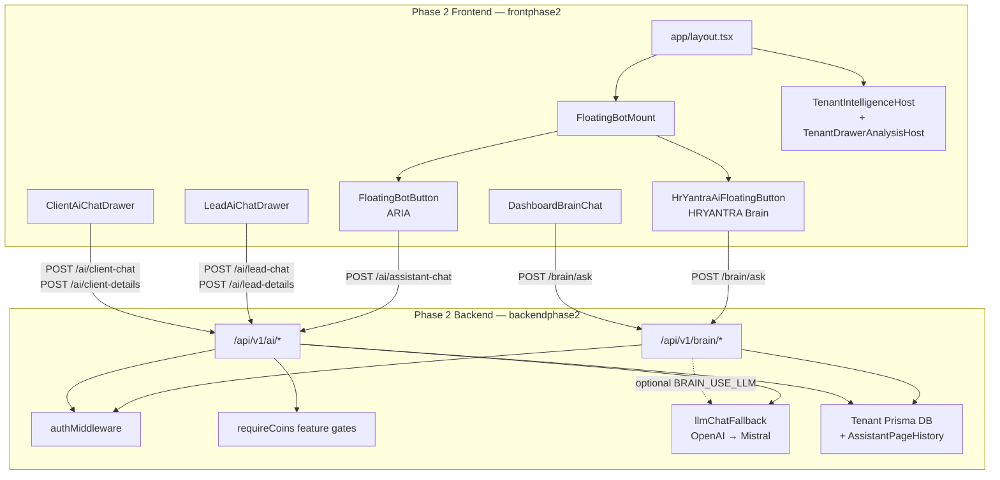
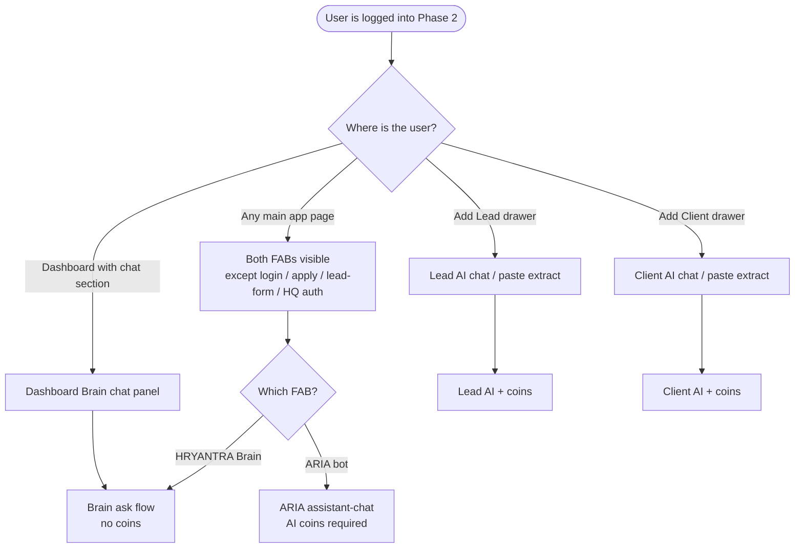
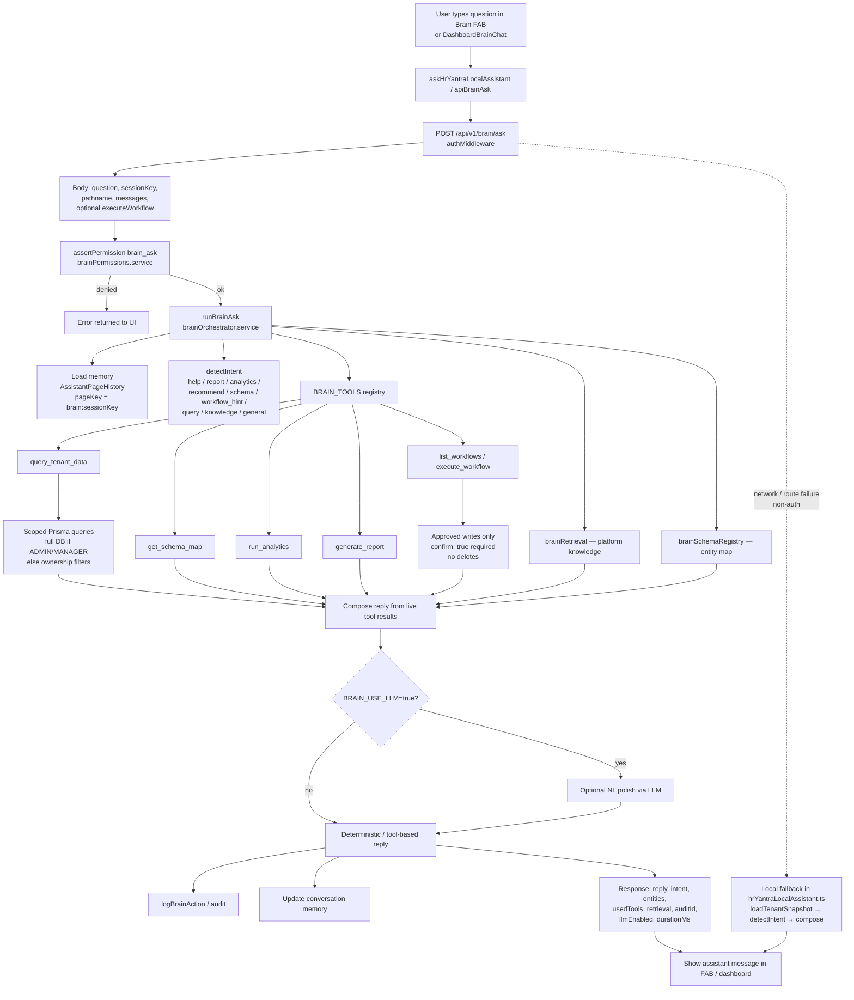
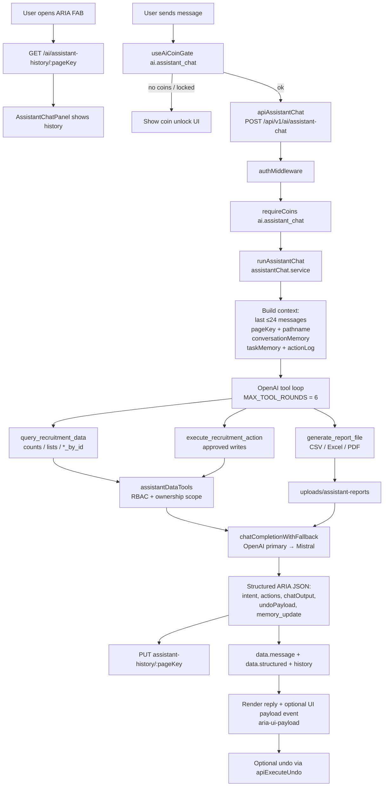
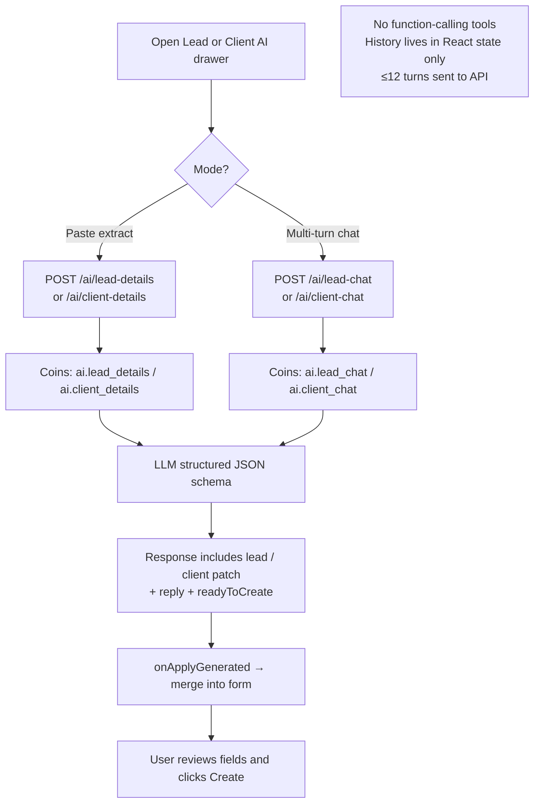
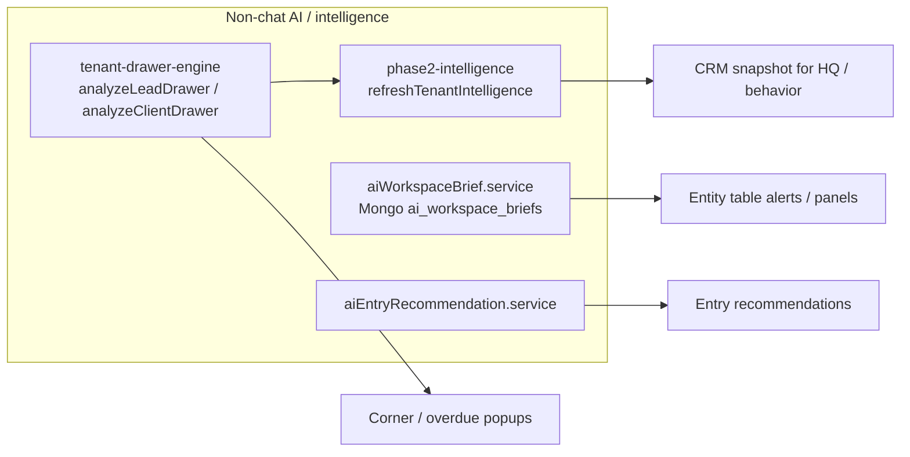
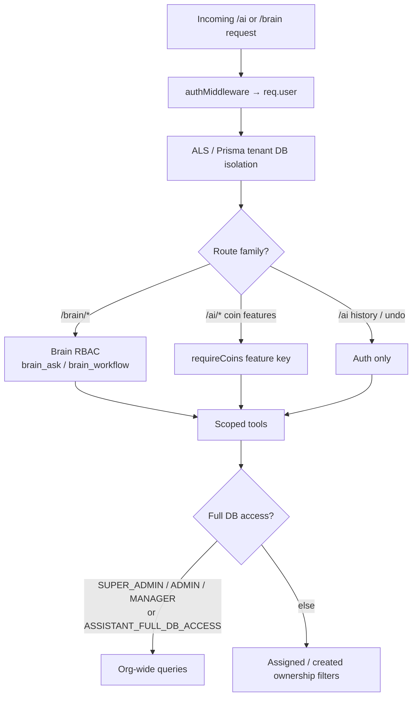
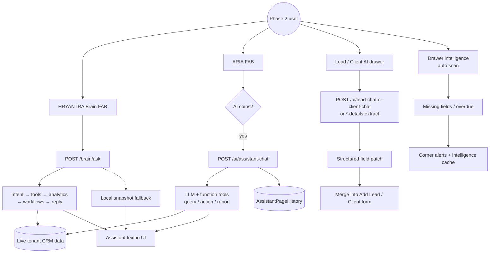

# How HRYANTRA AI Assistant Works (Phase 2)

This document explains how the **Phase 2** AI assistants work end-to-end: UI entry points, request flow, backend orchestration, tools, auth, coins, and history.

**Scope:** `frontphase2` + `backendphase2` only (not Phase 1 portal chat).

---

## 1. Overview — two assistants + helpers

Phase 2 runs **two chat assistants** side by side, plus form helpers and workspace intelligence.

| System | UI name | Primary entry | Backend base | LLM by default? | AI coins? |
|--------|---------|---------------|--------------|-----------------|-----------|
| **Enterprise Brain** | HRYANTRA Brain | Floating Brain FAB + Dashboard chat | `/api/v1/brain` | No (`BRAIN_USE_LLM=true` optional) | No |
| **ARIA** | ARIA · AI System Operator | Floating bot FAB | `/api/v1/ai/assistant-chat` | Yes (OpenAI → Mistral fallback) | Yes (`ai.assistant_chat`) |
| **Lead / Client AI** | Lead / Client assistant drawers | Add Lead / Add Client | `/api/v1/ai/lead-*`, `client-*` | Yes | Yes |
| **Workspace brief** | AI Workspace Brief / table alerts | Panels / entity alerts | `/api/v1/ai/workspace-brief*` | Yes (generate) | Yes (generate) |
| **Drawer intelligence** | Corner / overdue alerts | Global hosts (not a chat) | Client-side + CRM APIs | No | No |

Both FABs are mounted from the app layout via `FloatingBotMount`.

---

## 2. High-level system map



---

## 3. User journey — which assistant when



**Hidden routes (Brain FAB examples):** `/login`, `/hq/login`, `/apply*`, `/lead-form*`.  
ARIA also hides HQ / auth / public intake pages via `getAssistantPageConfig`.

---

## 4. Flow A — HRYANTRA Brain (Phase 2 Enterprise Brain)

### 4.1 End-to-end flowchart



### 4.2 Brain request / response shapes

**Request (`POST /api/v1/brain/ask`):**

```json
{
  "question": "How many open leads do I have?",
  "sessionKey": "hryantra-ui",
  "pathname": "/leads",
  "messages": [
    { "role": "user", "content": "..." },
    { "role": "assistant", "content": "..." }
  ],
  "executeWorkflow": {
    "action_type": "create_task",
    "record_id": null,
    "payload": {},
    "confirm": true
  }
}
```

- FAB uses `sessionKey: "hryantra-ui"`.
- Dashboard chat uses `sessionKey: "dashboard-chat"`, `pathname: "/dashboard"`.

**Response `data`:** `reply`, `intent`, `entities`, `usedTools`, `retrieval`, `auditId`, `llmEnabled`, `durationMs`.

### 4.3 Approved Brain write workflows

Needs permission `brain_workflow` (typically MANAGER+) and `confirm: true`:

- Leads: `create_lead`, `update_lead`, `convert_lead_to_client`
- Clients: `create_client`, `update_client`
- Jobs: `create_job`, `update_job`
- Candidates: `update_candidate`, `move_candidate_stage`
- Interviews / tasks / placements: schedule, create/update/complete, mark joined

**Deletes are forbidden.**

### 4.4 Local fallback (no Brain / no OpenAI)

If `/brain/ask` fails (non-auth), the FAB still answers using CRM list/metric APIs:

1. `loadTenantSnapshot()` — leads, clients, jobs, candidates, tasks, interviews, placements, contacts, calendar (±14 days), module metrics  
2. Merge cached tenant intelligence (incomplete / overdue counts)  
3. `detectIntent` → pulse / next actions / risks / follow-ups / hot leads / search / how-to  
4. Compose a deterministic reply (optional spell-correction note)

---

## 5. Flow B — ARIA (AI System Operator)

### 5.1 End-to-end flowchart



### 5.2 ARIA request / response

**Request:**

```json
{
  "messages": [
    { "role": "user", "content": "List my overdue tasks" },
    { "role": "assistant", "content": "..." }
  ],
  "pageKey": "leads",
  "pathname": "/leads"
}
```

**Response `data`:**

```json
{
  "message": "You have 3 overdue tasks…",
  "structured": {
    "intent": "...",
    "actions": [],
    "chatOutput": "...",
    "undoPayload": {},
    "memory_update": {}
  },
  "history": {}
}
```

ARIA is **page-aware** (`PAGE_ASSISTANT_CONFIGS`) so prompts and report entity mapping follow the current route.

---

## 6. Flow C — Lead / Client AI drawers

Used while filling **Add Lead** or **Add Client** forms.



**Lead chat body:** `{ message, currentForm?, history? }`  
**Lead chat response:** `{ reply, readyToCreate, lead }`  

Same pattern for clients → `client` patch. Required fields are encoded in system prompts (e.g. lead: company + email).

---

## 7. Flow D — Workspace brief & drawer intelligence (not chat)



- Drawer engine scans up to ~100 leads + ~100 clients for missing mandatory fields and overdue follow-ups/meetings.  
- Workspace brief generation is LLM + coin gated; stored alerts can surface in tables without a chat UI.

---

## 8. Auth, tenant isolation, and coins



| Feature | Coin key (examples) |
|---------|---------------------|
| ARIA chat | `ai.assistant_chat` |
| Lead extract / chat | `ai.lead_details`, `ai.lead_chat` |
| Client extract / chat | `ai.client_details`, `ai.client_chat` |
| Job AI | `ai.job_*` variants |
| Workspace brief generate | `ai.workspace_brief` |
| Brain ask | **Not** coin-gated |

---

## 9. History & streaming

| Store | Key | Used by |
|-------|-----|---------|
| Prisma `AssistantPageHistory` | `userId` + `pageKey` | ARIA history; Brain memory as `brain:<sessionKey>` |
| React local state | — | Brain FAB, DashboardBrainChat, Lead/Client drawers |
| `localStorage` | FAB position keys only | Button placement |

**Streaming:** there is **no** SSE / token streaming for Brain or ARIA chat. Each ask is a full request/response cycle.

---

## 10. Key files (quick index)

### Frontend (`frontphase2`)

| File | Role |
|------|------|
| `src/components/FloatingBotMount.tsx` | Mounts ARIA + Brain FABs |
| `src/components/HrYantraAiFloatingButton.tsx` | Phase 2 Brain FAB UI |
| `src/lib/hrYantraLocalAssistant.ts` | Brain ask + local CRM fallback |
| `src/components/FloatingBotButton.tsx` | ARIA FAB + page configs |
| `src/components/AssistantChatPanel.tsx` | ARIA send / undo / coins UI |
| `src/components/dashboard/enterprise/DashboardBrainChat.tsx` | Dashboard Brain panel |
| `src/components/leads/LeadAiChatDrawer.tsx` | Lead AI drawer |
| `src/components/clients/ClientAiChatDrawer.tsx` | Client AI drawer |
| `src/lib/api.ts` | `apiBrainAsk`, `apiAssistantChat`, lead/client AI clients |
| `src/lib/tenant-drawer-engine/*` | Analyze + alert + track |
| `src/lib/phase2-intelligence/*` | Shared intelligence cache |
| `src/components/coins/AiCoinGate.tsx` | Feature coin unlock |

### Backend (`backendphase2`)

| File | Role |
|------|------|
| `src/modules/brain/README.md` | Brain module overview |
| `src/modules/brain/brain.routes.js` | `/brain` routes |
| `src/modules/brain/orchestration/brainOrchestrator.service.js` | `runBrainAsk` |
| `src/modules/brain/tools/brainTools.registry.js` | Secure tools |
| `src/modules/brain/workflow/brainWorkflow.service.js` | Approved writes |
| `src/modules/brain/memory/brainMemory.service.js` | Memory via `AssistantPageHistory` |
| `src/modules/ai/ai.routes.js` | `/ai` routes |
| `src/modules/ai/assistantChat.service.js` | `runAssistantChat` + OpenAI tools |
| `src/modules/ai/assistantDataTools.js` | Scoped query / action / report |
| `src/modules/ai/assistantHistory.service.js` | History persistence |
| `src/services/llmChatFallback.service.js` | OpenAI → Mistral |
| `src/services/aiWorkspaceBrief.service.js` | Workspace briefs / alerts |

---

## 11. One-page master flowchart



---

## 12. Guarantees (as implemented)

1. **Tenant isolation** — every ask runs against the authenticated user’s tenant DB.  
2. **RBAC before tools / workflows** — Brain and ARIA actions respect role + ownership.  
3. **No fabricated Brain metrics by design** — answers are meant to cite live tool results.  
4. **Audit** — Brain asks / tools / workflows are logged (`/brain/audit`).  
5. **Brain does not require OpenAI** unless `BRAIN_USE_LLM=true`.  
6. **ARIA and form AI do require LLM** (with Mistral fallback) and usually **AI coins**.  
7. **No delete workflows** through Brain / ARIA action tools.

---

*Generated from Phase 2 codebase paths under `hrayntra_aws/frontphase2` and `hrayntra_aws/backendphase2`.*
