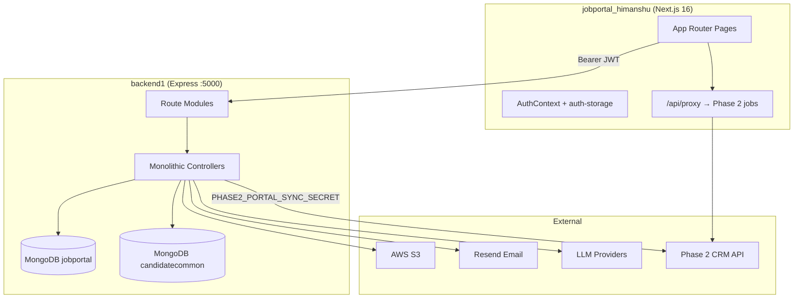

# Phase 1 Complete System Audit

**Audit Agent:** Phase 1 Agent  
**Audit Date:** May 2026  
**Scope:** Candidate Job Portal (Phase 1)  
**Frontend:** `C:\Users\Admin\Desktop\SAASAAll\jobportal_himanshu`  
**Backend:** `C:\Users\Admin\Desktop\SAASAAll\hrayntra_aws\backend1`  
**Audit Type:** CTO-Level Architecture, Security, Performance, and Feature Inventory  

---

## Document Control

| Field | Value |
|-------|-------|
| Version | 1.0 |
| Methodology | Static code analysis, route tracing, schema review, import graph inspection |
| Limitations | No production runtime profiling; secrets in committed docs flagged but not reproduced |

---

# 1. PROJECT OVERVIEW

## 1.1 Project Purpose

Phase 1 is the **candidate-facing job portal** for SAASA/Hrayntra: WhatsApp/email OTP login, rich candidate profiles, CV upload and parsing, job discovery, applications, interviews, notifications, LMS (courses, quizzes, resume builder, interview prep), and AI-assisted tools. It feeds Phase 2 CRM via **candidate common pool sync** and **Phase 2 job feed / portal application webhooks**.

## 1.2 Tech Stack

| Layer | Technology | Version / Notes |
|-------|------------|---------------|
| Frontend framework | Next.js (App Router) | 16.0.10 |
| UI library | React | 19.2.1 |
| Styling | Tailwind CSS | v4 |
| Animation | Framer Motion | ^12 |
| Rich text | TipTap | ^2.1 |
| Backend runtime | Node.js | >=18 |
| HTTP server | Express | ^4.18 |
| ORM | Prisma | ^5.19.1 |
| Database | MongoDB | Via `DATABASE_URL` |
| Secondary DB | MongoDB `candidatecommon` | `CANDIDATE_COMMON_DATABASE_URL` |
| Auth | JWT + email OTP (Resend) | 30-day token default |
| File storage | AWS S3 | `@aws-sdk/client-s3` (helpers named `Cloudinary` historically) |
| Email | Resend | OTP delivery |
| AI | OpenAI, Mistral, Gemini, Anthropic | Resume parsing, matching, LMS AI |
| PDF | Puppeteer, pdf-parse, mammoth | CV export/parse |
| Package manager | pnpm | lockfile present |

## 1.3 Architecture Overview



## 1.4 Authentication Method

- **Login:** `POST /api/auth/send-otp` → `POST /api/auth/verify-otp`
- **Token:** JWT signed with `JWT_SECRET` (fallback hardcoded in dev — **critical risk**)
- **Session:** Optional `Session` row in MongoDB; middleware self-heals missing session
- **Frontend storage:** `localStorage` + `sessionStorage` (`token`, `candidateId`) via `src/lib/auth-storage.ts`
- **Guard:** Client-side only (`AuthContext.tsx`); **no Next.js middleware.ts**
- **LMS:** Separate `lms.auth.middleware.js` (JWT only, no session table)

## 1.5 Deployment Architecture

| Component | Typical target |
|-----------|----------------|
| Frontend | Vercel (`NEXT_PUBLIC_VERCEL_URL` enables API proxy) |
| Backend | `api1.hryantra.com` (per `api-base.ts`) |
| DB | MongoDB Atlas |
| Static uploads | `/uploads` on Express + S3 |

## 1.6 External Integrations

| Integration | Env vars | Code |
|-------------|----------|------|
| AWS S3 | `AWS_*` | `src/lib/s3.js` |
| Resend | `RESEND_API_KEY` | `src/services/email.service.js` |
| Phase 2 sync | `PHASE2_PORTAL_SYNC_SECRET`, `PHASE2_INTERNAL_API_URL` | `application.controller.js`, `internal.routes.js` |
| Phase 2 public jobs | `PHASE2_PUBLIC_JOBS_URL` | `src/app/api/proxy/[...path]/route.ts` |
| AI providers | `OPENAI_*`, `MISTRAL_*`, etc. | Multiple controllers/services |

## 1.7 Folder Structure Overview

### Frontend (`jobportal_himanshu/`)

```
jobportal_himanshu/
├── public/
├── src/
│   ├── app/                 # 67+ page.tsx routes
│   │   ├── (website)/       # Marketing
│   │   ├── lms/             # Learning module
│   │   ├── api/             # proxy, resume-preview
│   │   └── …                # candidate flows
│   ├── components/          # auth, profile, modals, layout
│   ├── hooks/
│   ├── lib/                 # api-base, auth-storage
│   └── modules/             # interview-prep
├── next.config.ts
└── package.json
```

### Backend (`backend1/`)

```
backend1/
├── prisma/schema.prisma     # ~1463 lines, 48 models
├── src/
│   ├── server.js
│   ├── routes/              # 17 route modules
│   ├── controllers/         # Large monoliths (profile 4622 lines)
│   ├── middleware/auth.middleware.js
│   ├── services/            # AI, email, S3, matching, sync
│   └── lms/                 # LMS subdomain
└── uploads/
```

---

# 2. COMPLETE FEATURE INVENTORY

| Feature | Purpose | Status | Frontend | Backend | DB Models | Roles | Risks |
|---------|---------|--------|----------|---------|-----------|-------|-------|
| OTP Authentication | Candidate login | **Working** | `whatsapp/*`, `AuthContext` | `auth.*` | `OtpVerification`, `Session`, `Candidate` | Candidate | OTP fallback exposes codes; default JWT secret |
| Profile management | Full candidate profile | **Working** | `profile/page.tsx`, modals | `profile.controller.js` | 20+ profile models | Candidate | Most routes **unauthenticated** |
| Personal details (legacy) | Alternate profile UI | **Partial/Duplicate** | `personal-details/page.tsx` (4525 lines) | Same APIs | Same | Candidate | Duplicate UX with profile workspace |
| CV upload & parse | Resume ingestion | **Working** | `uploadcv`, `extract` | `cv.*` | `Resume`, `CvAnalysis` | Candidate | Open CV routes by candidateId |
| CV editor / PDF | Edit & export CV | **Working** | `cveditor`, `aicveditor` | `cveditor.*` | Resume versions | Candidate | Open endpoints |
| Resume editor (JSON) | Structured resume | **Working** | LMS resume studio | `resume-editor.*` | `LmsResumeDraft` | Candidate | — |
| Job explore & apply | Browse/apply jobs | **Working** | `explore-jobs/page.tsx` (3266 lines) | `job.*`, `application.*` | `Job`, `Application` | Candidate | Loads 500 jobs in memory; public seed/delete |
| Phase 2 job feed | External job list | **Working** | API proxy | Phase 2 HTTP | External | Candidate | Tenant header coupling |
| Applications | Track applications | **Working** | `applications/*` | `application.*` | `Application`, `Timeline` | Candidate | `MOCK_APPLICATIONS` dead code |
| Interviews | Interview detail | **Working** | `interviews/[id]` | via applications | `Interview` (portal) | Candidate | — |
| Notifications | In-app notifications | **Working** | `NotificationPanel` | `notification.*` | `Notification` | Candidate | **POST without auth** |
| Dashboard | Candidate home | **Working** | `candidate-dashboard` | `cv` dashboard | Aggregates | Candidate | — |
| LMS courses/quizzes | Learning | **Working** | `lms/**` | `lms/*` | `LmsCourse`, `LmsQuiz`, etc. | Candidate | Question bank placeholders |
| LMS interview prep | Mock interviews | **Partial** | `lms/interview-prep/*` | `lms/interview.service.js` | `LmsInterview*` | Candidate | Static placeholder questions |
| Global AI mock interview | Standalone mock | **Working** | `Aimockinter` | `mock-interview.*` | `GlobalAiInterview` | Candidate | **No auth** |
| AI chat / assist | Profile/job AI | **Working** | Various | `ai.*` | — | Candidate | **No auth** |
| ATS check | Marketing tool | **Working** | `(website)/ats-check` | `cv-analysis` | `CvAnalysis` | Public | — |
| Super admin delete | Purge candidates | **Working** | `superadminpage` | `candidate.*` | `Candidate` + relations | **None (FE only)** | **No RBAC** — any logged-in user + open API |
| Settings | Logout all sessions | **Working** | `settings` | `settings.*` | `Settings` | Candidate | Partial protect |
| Contact import | Bulk contacts | **Unknown** | — | `contact-import.*` | — | — | **No auth** |
| Internal webhooks | Phase 2 sync | **Working** | — | `internal.*` | — | Secret | Dev secret fallback |
| Candidate common sync | Phase 2 AI pool | **Working** | — | `candidateCommonSync.service.js` | `CandidateCommon` | System | Async fire-and-forget |

---

# 3. FRONTEND AUDIT

## 3.1 Route System

- **Router:** App Router only (`src/app/**/page.tsx`)
- **No `middleware.ts`** — all protection is client-side in `AuthContext`
- **Public routes:** Hardcoded list in `AuthContext.tsx` (lines ~41–60)
- **Gap:** `/superadminpage` is **not** in public routes but has **no role check** — any authenticated candidate can navigate

## 3.2 Component Architecture

| Pattern | Assessment |
|---------|------------|
| Page-level monoliths | **Poor** — `personal-details` (4525), `explore-jobs` (3266), `superadminpage` (1556) |
| Profile workspace | **Good** — modular under `components/profile/workspace/` |
| Auth | **Adequate** — `AuthContext`, `AuthGuard`, `InactivityGuard` (24h idle) |
| Reusable modals | **Good** — extensive `components/modals/` |

## 3.3 API Integration

| File | Role | Issue |
|------|------|-------|
| `src/lib/api-base.ts` | Base URL resolution | Prod vs dev |
| `src/lib/auth-storage.ts` | Dual storage sync | Correct fix for tab restore |
| `src/app/api/proxy/[...path]/route.ts` | Phase 2 proxy | Server-side only on Vercel |

**Issues:**
- No centralized error type handling
- Many pages call `fetch` directly vs shared client
- `next.config.ts`: `ignoreBuildErrors: true` — **masks TS errors in production builds**

## 3.4 State Management

- React Context (`AuthContext`, `LmsStateProvider`)
- Local component state dominant
- No Redux/Zustand — acceptable for size but leads to prop drilling in large pages

## 3.5 UI/UX Quality

| Area | Status |
|------|--------|
| Loading states | Present on major flows; inconsistent on secondary pages |
| Empty states | Partial |
| Error states | Toast/message patterns vary |
| Responsiveness | Tailwind-based; large tables may overflow on mobile |
| Accessibility | Limited ARIA audit; forms rely on visual labels |
| Theme | `globals.css` + Tailwind v4 |

## 3.6 Frontend Issues Summary

| Severity | Issue | Path |
|----------|-------|------|
| Critical | Super admin UI with no role gate | `superadminpage/page.tsx` |
| High | Mega-pages hurt bundle and maintainability | `personal-details`, `explore-jobs` |
| High | TypeScript errors ignored at build | `next.config.ts` |
| Medium | Duplicate profile UIs | `profile` vs `personal-details` |
| Medium | Dead mock data | `MOCK_APPLICATIONS` in `ApplicationsPageClient.tsx` |
| Low | LMS event registration “local only” note | `EventRegisterSheet.tsx` |

---

# 4. BACKEND AUDIT

## 4.1 API Structure

**Base:** `/api/*` mounted from `src/server.js`

| Prefix | Module | Auth |
|--------|--------|------|
| `/api/auth` | `auth.routes.js` | Public |
| `/api/profile` | `profile.routes.js` | **Mostly open** |
| `/api/cv` | `cv.routes.js` | **Open** |
| `/api/jobs` | `job.routes.js` | **Open** (includes seed/delete) |
| `/api/candidates` | `candidate.routes.js` | **No auth** |
| `/api/applications` | `application.routes.js` | Open |
| `/api/ai` | `ai.routes.js` | **No auth** |
| `/api/lms` | `lms/lms.router.js` | `requireLmsAuth` on sub-routes |
| `/api/lms/questions` | `lms-ai.routes.js` | **No auth** |
| `/api/mock-interview` | `mock-interview.routes.js` | **No auth** |
| `/api/notifications` | `notification.routes.js` | **No auth** |
| `/api/internal` | `internal.routes.js` | Shared secret |
| `/uploads` | Static | **Public** |

## 4.2 Middleware Chain

1. `dotenv.config()`
2. CORS (permissive: no Origin allowed, localhost always OK)
3. `express.json` / `urlencoded` — **50MB limit**
4. Static `/uploads`
5. Per-route handlers
6. Global error + 404 handlers

**No global authentication middleware.**

## 4.3 Controllers & Services

| File | Lines | Concern |
|------|-------|---------|
| `profile.controller.js` | ~4622 | God controller — split by domain |
| `application.controller.js` | ~1456 | Phase 2 sync complexity |
| `job.controller.js` | ~1390 | Matching + feed |
| `cv.controller.js` | ~1469 | Upload + dashboard |

## 4.4 Validation & Error Handling

- **Zod** used in LMS validators; inconsistent elsewhere
- Many controllers use ad-hoc validation
- Global error handler exists but response shapes vary by controller

## 4.5 Async & Background

| Mechanism | File |
|-----------|------|
| Deferred candidate common sync | `candidateCommonSync.service.js` |
| Session lastUsed throttle | `auth.middleware.js` |
| No cron/queue | — |

---

# 5. DATABASE AUDIT

## 5.1 Datasource

- **Provider:** MongoDB
- **Primary:** `DATABASE_URL` → database `jobportal` (typical)
- **Secondary:** `candidatecommon` for `CandidateCommon` (Phase 2 AI pool)

## 5.2 Model Inventory (48 models)

| Domain | Models |
|--------|--------|
| Auth | `Candidate`, `OtpVerification`, `Session`, `Settings` |
| Profile | `CandidateProfile`, `Education`, `WorkExperience`, `Skill`, `CandidateSkill`, … (15+ sub-entities) |
| Jobs | `Company`, `Client`, `Job`, `JobSkill`, `PipelineStage`, `Match`, `AiJobMatch`, `SavedJob` |
| Applications | `Application`, `ApplicationTimeline`, `ApplicationCommunication` |
| LMS | `LmsCourse`, `LmsLesson`, `LmsQuiz`, `LmsNote`, `LmsEvent`, … (12 models) |
| AI Interview | `GlobalAiInterview`, `GlobalAiInterviewMessage` |
| Cross-phase | `CandidateCommon` |

## 5.3 Schema Concerns

| Issue | Severity | Detail |
|-------|----------|--------|
| No formal RBAC collections | High | Identity = Candidate only |
| Nullable legacy fields | Medium | `clientId` optional on Job |
| Index coverage | Medium | Review compound indexes for `Application.candidateId+jobId` |
| Soft delete | Low | Not universal — hard deletes in super admin |
| Enum drift | Medium | `ApplicationStatus` vs CRM pipeline labels |

## 5.4 Relationships (Key)

```
Candidate 1──* Application *──1 Job
Candidate 1──1 CandidateProfile
Candidate 1──* Education, WorkExperience, …
Job 1──* PipelineStage, Match, Application
```

---

# 6. API FLOW MAPPING

## 6.1 OTP Login Flow

| Step | Component |
|------|-----------|
| 1 | `whatsapp/page.tsx` → `POST /api/auth/send-otp` |
| 2 | `auth.controller.js` → Resend email → `OtpVerification` |
| 3 | `whatsapp/verify/page.tsx` → `POST /api/auth/verify-otp` |
| 4 | JWT + `candidateId` → `auth-storage` sync |
| 5 | `GET /api/profile/:id` (protected subset) → render dashboard |

## 6.2 Job Apply Flow

| Step | Component |
|------|-----------|
| 1 | `explore-jobs/page.tsx` → `GET /api/jobs` or Phase 2 proxy |
| 2 | Apply action → `POST /api/applications` |
| 3 | `application.controller.js` → tenant Application + Phase 2 webhook |
| 4 | `ApplicationsPageClient.tsx` lists applications |

## 6.3 Super Admin Delete Flow

| Step | Component |
|------|-----------|
| 1 | `superadminpage/page.tsx` → `GET /api/candidates` (**no auth**) |
| 2 | Preview → `GET /api/candidates/:id/preview` |
| 3 | Delete → `DELETE /api/candidates/:id` |
| 4 | `candidate.controller.js` → cascade delete relations |

## 6.4 Profile Update Flow

| Step | Component |
|------|-----------|
| 1 | `profile/page.tsx` workspace section |
| 2 | `PUT /api/profile/...` (often **without protect**) |
| 3 | `profile.controller.js` → Prisma nested writes |
| 4 | `scheduleCandidateCommonSync` → `candidatecommon` |

---

# 7. BROKEN LOGIC & ISSUES

| ID | Severity | File | Problem | Root Cause | Fix |
|----|----------|------|---------|------------|-----|
| P1-001 | **Critical** | `auth.middleware.js`, `auth.controller.js` | Default JWT secret `saasa_jwt_secret_key_2024` | Fallback when `JWT_SECRET` unset | Require secret in prod; fail startup if missing |
| P1-002 | **Critical** | `candidate.routes.js` | Super-admin CRUD without auth | No `protect` middleware | Add auth + admin role or shared secret |
| P1-003 | **Critical** | `profile.routes.js` | Profile mutations open by `candidateId` | Selective `protect` only on 3 routes | Apply `protect` to all mutating routes |
| P1-004 | **Critical** | `SETUP_INSTRUCTIONS.md` | Live-looking credentials in repo | Committed secrets | Rotate all; use `.env.example` only |
| P1-005 | **High** | `job.routes.js` | `POST /seed`, bulk delete public | Dev endpoints exposed | Disable in production or protect |
| P1-006 | **High** | `ai.routes.js`, `mock-interview.routes.js` | Unauthenticated AI endpoints | Cost/abuse risk | Rate limit + JWT |
| P1-007 | **High** | `server.js` CORS | Allows missing Origin | Permissive callback | Strict origin list in prod |
| P1-008 | **Medium** | `job.controller.js` | 500 jobs loaded for matching | No server-side filter | Paginate + index queries |
| P1-009 | **Medium** | `ApplicationsPageClient.tsx` | `MOCK_APPLICATIONS` unused | Dead code | Remove |
| P1-010 | **Medium** | `next.config.ts` | `ignoreBuildErrors: true` | Build convenience | Fix TS errors; enable checks |
| P1-011 | **Medium** | `internal.routes.js` | Default sync secret | Dev fallback | Env-only secret |
| P1-012 | **Low** | `job-matching-pipeline.legacy.service.js` | Not wired | Superseded by phase1 service | Archive or delete |

---

# 8. SECURITY AUDIT

| Category | Finding | Severity |
|----------|---------|----------|
| JWT | Hardcoded fallback secret | Critical |
| Token storage | localStorage (XSS theft) | Medium |
| Password | N/A (OTP-only) | — |
| API exposure | Many write APIs without auth | Critical |
| File upload | 5MB/2MB limits on profile; 50MB JSON body | Medium |
| XSS | Rich text (TipTap) — sanitize on render | Medium |
| CORS | Permissive | High |
| SQL injection | N/A (Mongo/Prisma) | Low |
| Secrets in docs | Committed credentials | Critical |
| Admin escalation | FE-only super admin | Critical |
| Session | Optional Session table; LMS no session | Medium |
| Static files | `/uploads` public | High |

---

# 9. PERFORMANCE AUDIT

| Area | Issue | Recommendation |
|------|-------|----------------|
| `getPersonalizedJobs` | Up to 500 jobs in memory | Cursor pagination + indexes |
| Profile GET | Massive `include` graph | Field selection / GraphQL-style DTO |
| Frontend bundles | 3000+ line pages | Code split, lazy routes |
| Body limit | 50MB JSON | Reduce per-route |
| N+1 | Mostly avoided via includes | Audit hot paths |
| Caching | None | Redis or CDN for job lists |
| Images | S3 URLs | CloudFront + WebP |

---

# 10. CODE QUALITY AUDIT

| Dimension | Score | Notes |
|-----------|-------|-------|
| Naming | 6/10 | Cloudinary-named S3 functions |
| Organization | 5/10 | God controllers |
| Reusability | 6/10 | Good components; poor page splits |
| SOLID | 4/10 | Controllers do everything |
| Duplication | 5/10 | Multiple matching pipelines, dual profile UIs |
| Documentation | 7/10 | ROUTES_MAP, SETUP docs exist |
| Technical debt | **High** | Monoliths + open APIs |

---

# 11. MISSING FEATURES & IMPROVEMENTS

- Automated tests (unit, integration, E2E)
- Server-side RBAC for admin operations
- Rate limiting on public/AI endpoints
- Audit log for candidate data access
- Complete `.env.example` for frontend and backend
- API versioning consistency
- Observability (APM, structured correlation IDs)
- Content Security Policy headers
- Signed URLs for resume access
- Remove `ignoreBuildErrors` and enforce CI lint

---

# 12. FINAL SYSTEM HEALTH SCORE

| Category | Score | Explanation |
|----------|-------|-------------|
| **Frontend** | **62/100** | Modern stack (Next 16/React 19) but mega-pages, client-only auth, TS errors ignored |
| **Backend** | **55/100** | Feature-complete but insecure route matrix and god controllers |
| **Security** | **35/100** | Critical gaps: open APIs, default JWT, no admin RBAC |
| **Performance** | **58/100** | Workable at small scale; matching and profile loads won't scale |
| **Scalability** | **50/100** | Monoliths + in-memory job loads |
| **Maintainability** | **48/100** | 4000+ line files; duplicate flows |
| **Enterprise Readiness** | **40/100** | Not production-hardened without auth and test coverage |

**Overall Phase 1 Health: 50/100 (Functional Beta — Security Remediation Required)**

---

# 13. PRIORITY FIX ROADMAP

## Critical (0–2 weeks)

| Item | Effort | Risk if delayed | Dependency |
|------|--------|-----------------|------------|
| Remove JWT default secret; require env | 2h | Total account compromise | Deploy config |
| Auth on profile/candidate/job/AI routes | 3–5d | Data breach | Middleware refactor |
| Rotate committed credentials | 1d | Ongoing exposure | Ops |
| Protect or disable job seed/delete | 4h | Data wipe | Config flag |
| Super admin: server-side role + auth | 3d | Unauthorized deletes | Schema/role design |

## High (2–6 weeks)

| Item | Effort | Risk |
|------|--------|------|
| Tighten CORS | 4h | CSRF-like abuse |
| Rate limit AI and OTP | 2d | Cost abuse |
| Split `profile.controller.js` | 5d | Regression risk |
| Add integration tests for auth + apply | 5d | Regressions |
| Signed URLs for uploads | 3d | PII leak |

## Medium (6–12 weeks)

| Item | Effort |
|------|--------|
| Consolidate profile vs personal-details | 10d |
| Paginate job matching | 3d |
| Remove `ignoreBuildErrors` | 5d |
| Frontend middleware auth | 2d |

## Low (Backlog)

| Item | Effort |
|------|--------|
| Remove dead matching legacy services | 1d |
| LMS placeholder content → real bank | 5d |
| Bundle analysis + code splitting | 3d |

---

*End of Phase 1 Complete Audit — Phase 1 Agent*
