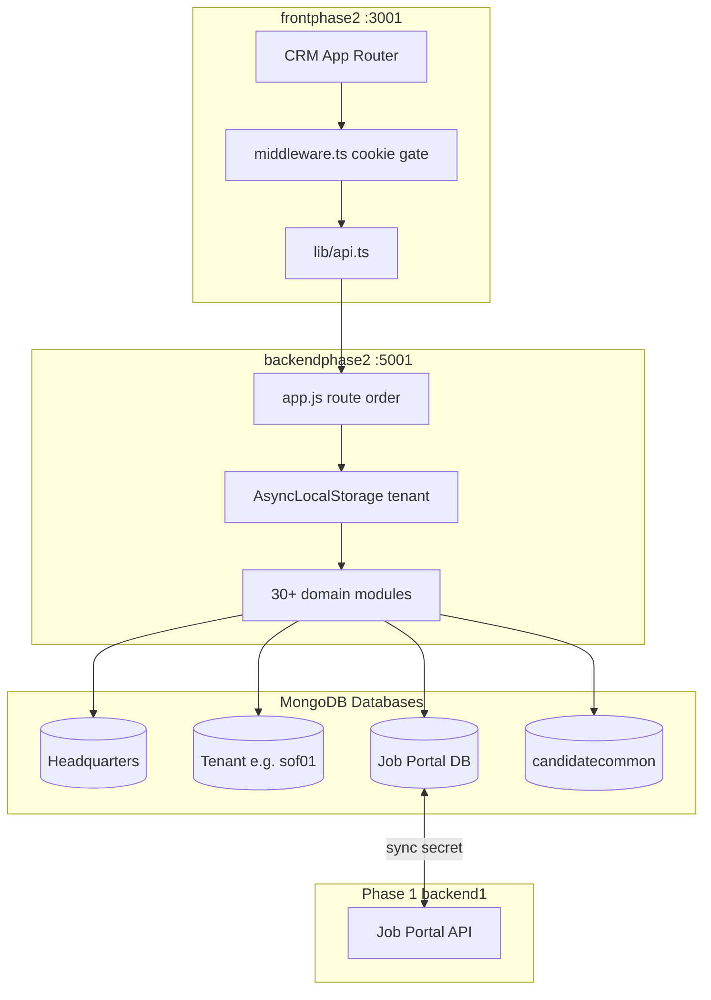

# Phase 2 Complete System Audit

**Audit Agent:** Phase 2 Agent  
**Audit Date:** May 2026  
**Scope:** Multi-Tenant Recruitment CRM (Phase 2)  
**Backend:** `C:\Users\Admin\Desktop\SAASAAll\hrayntra_aws\backendphase2`  
**Frontend:** `C:\Users\Admin\Desktop\SAASAAll\hrayntra_aws\frontphase2`  
**Audit Type:** CTO-Level Architecture, Security, Performance, and Feature Inventory  

---

## Document Control

| Field | Value |
|-------|-------|
| Version | 1.0 |
| Methodology | Static code analysis, route mount order review, multi-DB tracing, permission matrix review |
| Integration | Phase 1 (`backend1` job portal + `candidatecommon` pool) |

---

# 1. PROJECT OVERVIEW

## 1.1 Project Purpose

Phase 2 is the **recruiter/employer CRM**: multi-tenant job management, candidates, clients, leads, pipeline, AI matching, interviews, placements, billing, reports, team/roles, HQ platform admin, and **public job apply links**. It mirrors data to the Phase 1 job portal database and syncs with the shared **candidate common** pool for AI matching.

## 1.2 Tech Stack

| Layer | Technology | Version / Notes |
|-------|------------|---------------|
| Frontend | Next.js (App Router) | 15.1 |
| UI | React | 18.3 |
| Styling | Tailwind 3.4, MUI 9 | Mixed design systems |
| Data fetching | SWR + monolithic `api.ts` | ~5,782 lines |
| Backend | Express | 4.19 |
| ORM | Prisma | 5.19 |
| Database | MongoDB (multi-DB) | Tenant + HQ + portal + common |
| Auth | JWT access/refresh | Default ~10 year expiry |
| Cache | Redis (optional) | Permission cache 300s |
| Realtime | Socket.IO | Bulk CV duplicate resolution |
| Storage | AWS S3 | Named `uploadBufferToCloudinary` |
| Email | Resend, Nodemailer, Gmail API | Invoice templates |
| AI/CV | OpenAI, Mistral, Tesseract, pdf-parse | Match engine + CV parsing |
| Dev port | Frontend 3001, Backend 5001 | — |

## 1.3 Architecture Overview



## 1.4 Multi-Tenant Architecture

| DB | Resolution | Access |
|----|------------|--------|
| **Tenant** | JWT `tenantDbName`, header `x-tenant-db-name`, query param | `prisma` Proxy + ALS |
| **Headquarters** | `HEADQUARTERS_DATABASE_URL` | HQ routes, provisioning |
| **Job Portal** | `JOB_PORTAL_DATABASE_URL` | `getJobPortalPrismaClient()` |
| **Candidate Common** | `CANDIDATE_COMMON_DATABASE_URL` | AI match pool |

**Critical path:** `src/config/prisma.js` — `buildTenantDatabaseUrl`, `runWithTenantContext`

## 1.5 Authentication & Authorization

- **Login:** `POST /api/v1/auth/login` → access + refresh tokens
- **Frontend:** `accessToken` in cookie (middleware) + localStorage (`api.ts` sync)
- **Backend:** `auth.middleware.js` — **accepts decoded expired JWT if user active** (see security)
- **Permissions:** `SystemRole` → `RolePermission` → `requireAnyPermission` / `requirePermission`
- **Super Admin:** `role === SUPER_ADMIN` or roleName `Super Admin` → `['all']`

## 1.6 Folder Structure

### Backend

```
backendphase2/
├── prisma/schema.prisma      # ~2111 lines, 56 models
├── src/
│   ├── app.js                # Route mount order (security-critical)
│   ├── server.js             # HTTP + Socket.IO
│   ├── config/               # env, prisma
│   ├── middleware/           # 11 files
│   ├── modules/              # Domain modules
│   ├── controllers/          # addCandidate, aria, interview
│   ├── routes/               # Legacy + TS duplicates
│   └── services/             # cvParsing, jobMatchEngine, email
├── docs/
└── ROUTES_MAP.md
```

### Frontend

```
frontphase2/
├── src/
│   ├── app/                  # 33+ CRM routes + public apply/review
│   ├── components/           # drawers, tables, billing, dashboard
│   ├── lib/api.ts            # Monolithic API client
│   ├── middleware.ts         # Edge auth
│   └── hooks/usePermissions.ts
└── vercel.json
```

---

# 2. COMPLETE FEATURE INVENTORY

| Feature | Purpose | Status | Frontend | Backend | DB | Permissions | Risks |
|---------|---------|--------|----------|---------|-----|-------------|-------|
| Auth (login/refresh) | Recruiter access | **Working** | `login/page.tsx` | `modules/auth/*` | `User`, `UserCredential` | Public | 10y JWT; decode bypass |
| Dashboard | KPI widgets | **Working** | `dashboard/page.tsx` | `modules/dashboard/*` | Aggregates | `dashboard_read` | Widget query cost |
| Candidates | CRM candidate list | **Working** | `candidate/page.tsx` | `candidate.service.js` | `Candidate` | `candidates_read` | **In-memory pagination merge** |
| Add candidate / bulk CV | Manual + ZIP upload | **Working** | `AddCandidateDrawer` | `addCandidate.controller.js` | `Candidate`, `CandidateFile` | `candidates_create` | 2GB ZIP limit |
| Jobs | Job CRUD, publish | **Working** | `job/page.tsx` (2831 lines) | `modules/job/*` | `Job` | `jobs_*` | Large page |
| **Public apply link** | Google Forms-style apply | **Working** | `apply/[token]` | `jobPublicApply.*` | `Job`, `Application` | Public + `jobs_read` for link | Tenant ALS on multipart |
| Application form builder | Custom apply schema | **Working** | `ApplicationFormBuilderModal` | templates CRUD | `JobApplicationFormTemplate` | `jobs_update` | — |
| Clients | Client CRM | **Working** | `client/page.tsx` | `modules/client/*` | `Client` | `clients_*` | — |
| Leads | Lead management | **Working** | `leads/page.tsx` | `modules/lead/*` | `Lead` | `leads_*` | — |
| Contacts | Contact directory | **Working** | `contacts/*` | `modules/contact/*` | `Contact` | contacts perms | — |
| Matches / AI | Job-candidate matching | **Working** | `matches/page.tsx` | `match.service.js`, `jobMatchEngine` | `Match` | `jobs_read` | 5000 common pool cap |
| Pipeline | Stage management | **Working** | `pipeline/page.tsx` | `modules/pipeline/*` | `PipelineStage`, `PipelineEntry` | `move_pipeline` | — |
| Interviews | Schedule & feedback | **Working** | `interviews/page.tsx` | `modules/interview/*` | `Interview*` | `interviews_*` | — |
| Client review (public) | External feedback | **Working** | `client-review/[token]` | public interview routes | — | Public token | File upload |
| Placements | Placement tracking | **Working** | `placement/*`, `placements/*` | `modules/placement/*` | `Placement*` | placements perms | Duplicate routes |
| Billing | Invoices & records | **Working** | `billing/page.tsx` | `modules/billing/*` | `BillingRecord` | billing perms | — |
| Reports | Analytics export | **Working** | `reports/page.tsx` | `modules/report/*` | — | `reports_read` | Heavy aggregates |
| Tasks & activities | Work management | **Partial** | `Task&Activites/page.tsx` | `task`, `activity` | `Task`, `Activity` | tasks perms | TODO navigation |
| Calendar | Meetings | **Working** | `calendar/page.tsx` | `calendar.routes.js` | `ScheduledMeeting` | — | Google/MS OAuth |
| Inbox | Messaging threads | **Working** | `inbox/page.tsx` | `modules/inbox/*` | `Thread`, `Message` | — | — |
| Team | Team members | **Working** | `team/page.tsx` | `modules/team/*` | `Team`, `TeamMember` | `team_*` | — |
| Roles & permissions | RBAC | **Working** | `administration/page.tsx` | `modules/role/*` | `SystemRole`, `Permission` | `manage_settings` | 5min cache delay |
| Settings | Org + comms | **Working** | `setting/page.tsx` | `modules/setting/*` | `Setting` | `manage_settings` | — |
| Recycle bin | Soft delete restore | **Working** | `recycle-bin/page.tsx` | trash/purge services | `isDeleted` flags | — | — |
| HQ platform | Tenant provisioning | **Working** | `hq/page.tsx` | `modules/hq/*` | HQ DB | Email allowlist | **`POST /hq/setup` unauthenticated** |
| Portal sync | Phase 1 application mirror | **Working** | — | `portal-sync.routes.js` | Portal DB | Shared secret | Dev secret fallback |
| LinkedIn / OAuth | Integrations | **Partial** | `auth/linkedin/callback` | `linkedin`, `oauth` | tokens | integrations | Rate limit partial |
| AI assistant (Aria) | In-app bot | **Working** | `FloatingBotMount` | `ariaRoutes.js`, `ai/*` | `AssistantPageHistory` | AI perms | Cost |
| Notifications | In-app alerts | **Working** | Sidenav badge | `notification/*` | `Notification` | — | — |
| PDF/resume proxy | Document viewing | **Working** | API routes | `pdfProxy`, `resume-preview` | — | Mixed | SSRF review |

---

# 3. FRONTEND AUDIT

## 3.1 Routes (33+ pages)

| Route | Module | Auth |
|-------|--------|------|
| `/login`, `/reset-password` | Auth | Public |
| `/dashboard` | Dashboard | Protected |
| `/candidate`, `/job`, `/client`, `/leads`, `/contacts` | CRM core | Protected |
| `/matches`, `/pipeline`, `/interviews` | Hiring | Protected |
| `/placement`, `/placements`, `/billing`, `/reports` | Ops | Protected |
| `/team`, `/administration`, `/setting`, `/calendar`, `/inbox` | Admin | Protected |
| `/Task&Activites`, `/recycle-bin`, `/help-center` | Ops | Protected |
| `/hq`, `/hq/login` | Platform | HQ allowlist |
| `/apply/[token]` | Public apply | **Public** |
| `/client-review/[token]` | Client feedback | **Public** |

## 3.2 Middleware (`src/middleware.ts`)

- Public: `/login`, `/hq/login`, `/reset-password`, `/api`, `/client-review`, `/apply`
- Protected: requires `accessToken` cookie
- **Gap:** Permission checks are **client-side only** (`usePermissions`) — backend enforces separately

## 3.3 Component Architecture

| Strength | Weakness |
|----------|----------|
| Rich drawer system (`CreateJobDrawer`, `AddCandidateDrawer`, `JobDetailsDrawer`) | `job/page.tsx` ~2831 lines |
| Reusable tables (`CandidateTable`, filters) | `api.ts` monolith |
| Stage tabs, bulk actions | MUI + Tailwind mix |
| `UserPermissionsSync` | HQ allowlist in `NEXT_PUBLIC_*` (visible) |

## 3.4 API Client (`src/lib/api.ts`)

- **~5,782 lines** — all domain APIs in one file
- Token sync: localStorage ↔ cookie for middleware alignment
- Tenant header: `x-tenant-db-name` on requests
- **Risk:** Bundle size, merge conflicts, no domain separation

## 3.5 State & Data

- SWR on some pages; many use `useEffect` + direct API calls
- Permissions from `localStorage` + refresh on focus
- No global Redux — acceptable with discipline

## 3.6 UI Quality

| Area | Assessment |
|------|------------|
| Loading | Table loading states on candidates/jobs |
| Empty | Present on major lists |
| Errors | Toast patterns (varied) |
| Responsive | Tables scroll; drawers mobile-aware |
| Public apply | 2-step flow, `PublicJobOverviewPanel` |

## 3.7 Frontend Issues

| ID | Severity | Issue | Path |
|----|----------|-------|------|
| P2-FE-01 | High | Monolithic `api.ts` | `src/lib/api.ts` |
| P2-FE-02 | High | `job/page.tsx` size | `app/job/page.tsx` |
| P2-FE-03 | Medium | TODO reject candidate | `job/page.tsx` ~2270 |
| P2-FE-04 | Medium | TODO task navigation | `Task&Activites/page.tsx` |
| P2-FE-05 | Medium | HQ email in public env | `.env.example` |

---

# 4. BACKEND AUDIT

## 4.1 Route Mount Order (Security-Critical)

From `src/app.js` — order matters:

1. CORS, body parsers (15mb default), compression, loggers
2. **`tenantContextMiddleware`** (ALS)
3. `/api/v1/internal` — portal sync (**secret**)
4. Public: pdf-proxy, resume-preview
5. `/api/v1/auth`
6. **Public apply** at app level (before auth routers)
7. Authenticated modules (`users`, `candidates`, `jobs`, …)
8. `addCandidate.routes` on `/api/v1` with **router-level auth**
9. `errorMiddleware`

## 4.2 Domain Modules (`src/modules/`)

`auth`, `user`, `candidate`, `client`, `contact`, `job`, `lead`, `agreement`, `pipeline`, `match`, `interview`, `placement`, `billing`, `task`, `activity`, `inbox`, `report`, `team`, `role`, `department`, `setting`, `ai`, `social`, `linkedin`, `oauth`, `integration`, `notification`, `dashboard`, `hq`, `internal`, `files`, `twilio-test`, `user-communication`, `stage`

## 4.3 Middleware

| File | Role |
|------|------|
| `auth.middleware.js` | JWT + decode fallback |
| `permission.middleware.js` | RBAC + Redis cache |
| `tenant-context.middleware.js` | ALS + public apply tenant |
| `validate.middleware.js` | Zod (interviews) |
| `upload.middleware.js` | Multer memory/disk |
| `error.middleware.js` | Global errors |
| `rateLimit.middleware.js` | LinkedIn only |

## 4.4 Heavy Services

| File | Lines | Role |
|------|-------|------|
| `candidate.service.js` | ~3768+ | List merge, CRUD, reject sweep |
| `cvParsing.service.js` | ~2737 | Multi-pass CV |
| `addCandidate.controller.js` | Large | Bulk CV, parse |
| `match.service.js` | Large | AI match orchestration |
| `jobPublicApply.service.js` | ~550 | Public apply + portal sync |

## 4.5 API Consistency

- Response helpers: `sendResponse`, `sendError`, `formatPaginationResponse`
- Permission aliases: legacy + new names (`jobs_read` + `view_jobs`)
- Some routes duplicated: `/api/team` and `/api/v1/team`, roles TS+JS

---

# 5. DATABASE AUDIT

## 5.1 Schema Stats

- **File:** `prisma/schema.prisma` (~2111 lines)
- **Models:** 56
- **Enums:** 30

## 5.2 Model Groups

| Domain | Key models |
|--------|------------|
| Admin | `User`, `SystemRole`, `Permission`, `RolePermission`, `Department`, `Team` |
| CRM | `Client`, `Contact`, `Lead`, `Job`, `Candidate` |
| Hiring | `Match`, `Application`, `PipelineStage`, `PipelineEntry`, `Interview*` |
| Revenue | `Placement*`, `BillingRecord` |
| Ops | `Task`, `Activity`, `Notification`, `Report` |
| Comms | `Thread`, `Message`, `UserOAuthTokens`, `IntegrationConnection` |
| Phase 1 bridge | `CandidateCommon` |
| Apply forms | `JobApplicationFormTemplate`, `Job.applyLinkToken`, `applicationFormSchema` |

## 5.3 Multi-DB Concerns

| Risk | Detail |
|------|--------|
| ID collision | Same candidate `id` across tenant + portal |
| Merge consistency | `mergePortalAndTenantCandidateRow` must preserve job links |
| Tenant isolation | URL pathname swap — verify no cross-tenant leak in ALS |
| Soft delete | `isDeleted` on Job/Candidate — portal row may remain |
| Index gaps | `applyLinkToken`, `assignedJobs`, `supportingRecruiters` |

## 5.4 Job Model (Recruiting ownership)

Fields for visibility scoping:

- `createdById`, `assignedToId`, `managerId`, `supportingRecruiters[]`
- `tenantDbName`, `applyLinkToken`, `applicationFormSchema`

---

# 6. API FLOW MAPPING

## 6.1 Recruiter Login

```
/login/page.tsx
  → POST /api/v1/auth/login
  → auth.controller → User + JWT (tenantDbName in payload)
  → syncAuthCookie('accessToken')
  → GET /api/v1/users/me/permissions
  → usePermissions → localStorage
  → redirect /dashboard
```

## 6.2 Candidate List (Mine Tab)

```
/candidate?tab=mine
  → GET /api/v1/candidates?mine=true&page&limit
  → candidate.controller → candidate.service.getAll
  → buildMineCandidatesScope(userId) + buildCrmCandidatesListScopeClause
  → Promise.all [tenant findMany (ALL rows), portal findMany]
  → merge → filter → sort → slice(page)
  → annotateCandidateListFlags → formatPaginationResponse
  → mapBackendCandidate → CandidateTable
```

## 6.3 Public Job Apply

```
/apply/[token]?tenantDbName=sof01
  → GET /api/v1/jobs/public/apply/:token (no JWT)
  → runWithTenantContext → jobPublicApply.service.getPublicApplyPage
  → User submits multipart
  → POST .../submit (publicApplyTenantMiddleware re-applies ALS)
  → Create/update Candidate, Application, Match, PipelineEntry
  → syncPortalCandidateAfterApplyLink
  → 201 success UI
```

## 6.4 AI Match Run

```
/matches/page.tsx
  → GET /api/v1/matches?jobId&source=ai|applied
  → match.service → jobMatchEngine / loadAppliedMatchCandidatePool
  → CandidateCommon pool (up to MATCH_COMMON_POOL_MAX)
  → Score + persist Match rows
  → Frontend ranked list + expand analysis
```

## 6.5 Portal Sync (Phase 1 → Phase 2)

```
backend1 application submit
  → POST /api/v1/internal/sync-portal-application
  → Header x-phase2-portal-sync-secret
  → portal-sync.service → tenant Application/Match
```

---

# 7. BROKEN LOGIC & ISSUES

| ID | Severity | File | Problem | Root Cause | Fix |
|----|----------|------|---------|------------|-----|
| P2-001 | **Critical** | `auth.middleware.js` | Expired JWT still accepted via decode | Fallback user load | Reject expired; use refresh token flow only |
| P2-002 | **Critical** | `hq.routes.js` | `POST /api/v1/hq/setup` no auth | Bootstrap convenience | One-time token or CLI-only |
| P2-003 | **High** | `candidate.service.js` getAll | Loads ALL candidates then slices | Tenant merge design | DB-level pagination post-merge or SQL $facet |
| P2-004 | **High** | `portal-sync.routes.js` | Default sync secret in dev | Fallback string | Fail closed in production |
| P2-005 | **High** | `app.js` | `/uploads` static public | No signed URLs | S3 presigned or auth proxy |
| P2-006 | **Medium** | `env.js` | JWT 3650d default expiry | Config default | 1h access + 7d refresh |
| P2-007 | **Medium** | `mergePortalAndTenantCandidateRow` | Portal overwrote tenant relations | Spread order | Fixed: tenant-priority merge (recent) |
| P2-008 | **Medium** | `buildMineCandidatesScope` | Missed manager/supporting recruiter | Narrow job OR | Fixed: `buildMyJobsWhereClause` (recent) |
| P2-009 | **Medium** | `files.service.js` | Create/delete not implemented | Stub | Implement or remove routes |
| P2-010 | **Low** | `job/page.tsx` | TODO reject candidate | Incomplete UI | Wire to reject API |
| P2-011 | **Low** | Duplicate route files | `teamRoutes.js` + `.ts` | Migration drift | Consolidate |

---

# 8. SECURITY AUDIT

| Category | Finding | Severity |
|----------|---------|----------|
| JWT expiry | 10-year default | Critical |
| JWT verify bypass | Decode without verify on failure | Critical |
| HQ setup | Unauthenticated bootstrap | Critical |
| Portal sync secret | Hardcoded dev fallback | High |
| Tenant header spoof | `x-tenant-db-name` on some flows | High (if endpoint under-protected) |
| Static uploads | `/uploads` without auth | High |
| Public apply | Unauthenticated file upload (8MB/file) | Medium |
| CORS | No Origin allowed | Medium |
| Permissions cache | 5 min stale RBAC | Medium |
| HQ allowlist | `NEXT_PUBLIC_HQ_ALLOWED_EMAILS` | Medium |
| Rate limiting | LinkedIn post only | Low |
| `USER_CREDENTIALS.md` in repo | Credential doc | Medium |
| RBAC on routes | Generally good on `/api/v1/*` | Strength |

---

# 9. PERFORMANCE AUDIT

| Hotspot | Impact | Recommendation |
|---------|--------|----------------|
| `candidate.service.getAll` tenant merge | O(N) memory per request | Pre-filter in DB; paginate before merge |
| `fetchCandidateCommonForMatchPipeline` | Up to 5000 rows | Stream or index by job skills |
| `cvParsing.service.js` | CPU + LLM cost per file | Queue workers |
| Bulk CV ZIP | 2GB / 2000 files | Socket progress; cap per tenant |
| `api.ts` bundle | Slow initial load | Split by domain, dynamic import |
| Permission Redis | 300s TTL | Invalidate on role change |
| Job page render | 2831-line component | Split tabs into lazy chunks |

---

# 10. CODE QUALITY AUDIT

| Dimension | Score | Notes |
|-----------|-------|-------|
| Naming | 7/10 | Consistent module layout; S3/Cloudinary naming debt |
| Organization | 6/10 | Good `modules/`; legacy `routes/` duplication |
| Reusability | 6/10 | Strong drawers; weak API client split |
| SOLID | 5/10 | `candidate.service` does too much |
| Duplication | 5/10 | Dual placement routes, team routes TS+JS |
| Documentation | 8/10 | ROUTES_MAP, FRONTEND_TO_BACKEND_MAP |
| Testing | **1/10** | No automated tests found |
| Technical debt | **High** | Monoliths + merge pagination |

---

# 11. MISSING FEATURES & IMPROVEMENTS

- Automated test suite (unit + API + E2E)
- CI pipeline with lint, typecheck, security scan
- Centralized audit log for candidate/client access
- API rate limiting (global)
- Observability (OpenTelemetry, request IDs everywhere)
- Signed media URLs
- Webhook retry queue for portal sync
- Feature flags for HQ bootstrap
- Complete `.env.example` matching `env.js`
- Remove `USER_CREDENTIALS.md` from repo
- Consolidate `placement` vs `placements` routes
- Split `api.ts` into `@/lib/api/candidates`, `jobs`, etc.
- Enterprise SSO (SAML/OIDC) — not present

---

# 12. FINAL SYSTEM HEALTH SCORE

| Category | Score | Explanation |
|----------|-------|-------------|
| **Frontend** | **68/100** | Mature CRM UI, public apply, but monolithic pages and API client |
| **Backend** | **65/100** | Broad module coverage, RBAC, multi-DB — undermined by auth policy and merge perf |
| **Security** | **45/100** | RBAC on most routes; critical JWT/HQ/setup/upload issues |
| **Performance** | **52/100** | Candidate list merge won't scale; CV/AI heavy |
| **Scalability** | **55/100** | Multi-tenant ALS good; list endpoints need redesign |
| **Maintainability** | **58/100** | Better modularization than Phase 1; still large services |
| **Enterprise Readiness** | **52/100** | Closer than Phase 1; needs tests, auth hardening, pagination fix |

**Overall Phase 2 Health: 56/100 (Production-Capable CRM with Known Hardening Gaps)**

---

# 13. PRIORITY FIX ROADMAP

## Critical (0–2 weeks)

| # | Task | Effort | Risk | Deps |
|---|------|--------|------|------|
| 1 | Fix JWT verify — reject expired tokens | 1d | Session hijack / stale access | Auth FE refresh flow |
| 2 | Secure `POST /hq/setup` | 1d | Tenant DB wipe / admin creation | Ops process |
| 3 | Remove portal sync secret fallback in prod | 4h | Cross-system spoof | Phase 1 env |
| 4 | Protect `/uploads` or move to presigned S3 | 3d | Resume/PII leak | S3 config |
| 5 | Short-lived access tokens (1h) + refresh | 2d | Long-lived compromise | FE cookie handling |

## High (2–6 weeks)

| # | Task | Effort | Risk |
|---|------|--------|------|
| 6 | Server-side pagination for tenant candidate list | 5d | OOM / slow lists at scale |
| 7 | Split `api.ts` into domain modules | 5d | Dev velocity / bundle |
| 8 | Global API rate limiting | 2d | Abuse |
| 9 | Integration tests: auth, apply link, permissions | 8d | Regressions |
| 10 | Invalidate permission cache on role change | 1d | Stale access |
| 11 | Audit logging for candidate/client reads | 5d | Compliance |

## Medium (6–12 weeks)

| # | Task | Effort |
|---|------|--------|
| 12 | Refactor `candidate.service.js` into list/sync/reject submodules | 10d |
| 13 | Split `job/page.tsx` by tabs | 5d |
| 14 | Remove duplicate route files (team, roles) | 2d |
| 15 | Complete `files.service` CRUD or remove | 3d |
| 16 | Implement task related-entity navigation TODO | 2d |

## Low (Backlog)

| # | Task | Effort |
|---|------|--------|
| 17 | Consolidate placement routes | 3d |
| 18 | SSRF review on pdf-proxy | 2d |
| 19 | Bundle analysis + lazy routes | 3d |
| 20 | Remove repo credential markdown files | 1h |

---

## Cross-Phase Integration Summary

| Integration | Direction | Mechanism |
|-------------|-----------|-----------|
| Public jobs on portal | P2 → P1 FE | Next proxy `phase2-public-jobs` |
| Application sync | P1 → P2 | `internal/sync-portal-application` |
| Candidate common AI pool | Bidirectional | `candidatecommon` DB |
| Public apply | P2 host `/apply` | Writes tenant + portal DB |
| Notifications | P2 → P1 API | `JOB_PORTAL_API_URL` |

**Recommendation:** Treat Phase 1 + Phase 2 as a **single product** for security releases — JWT/secret rotation and upload policy must align.

---

*End of Phase 2 Complete Audit — Phase 2 Agent*
