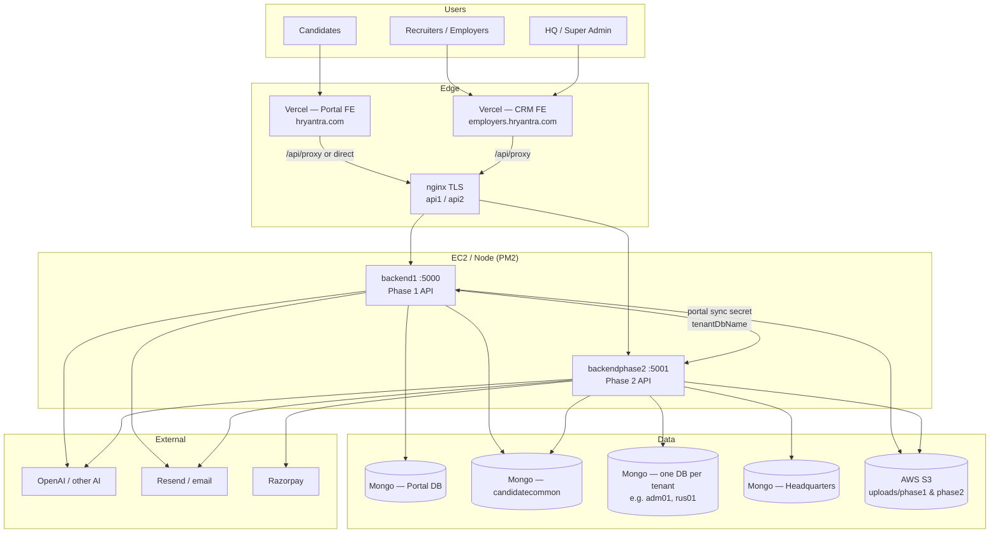
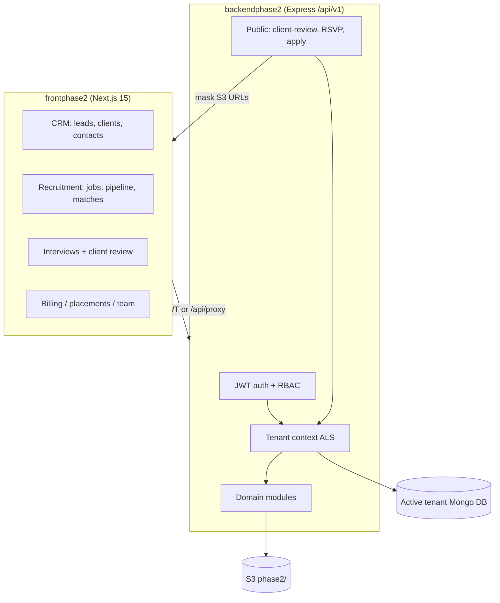
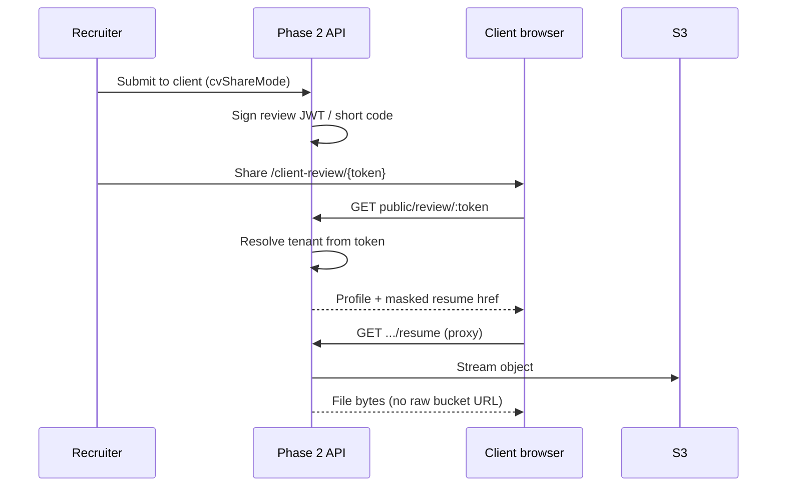
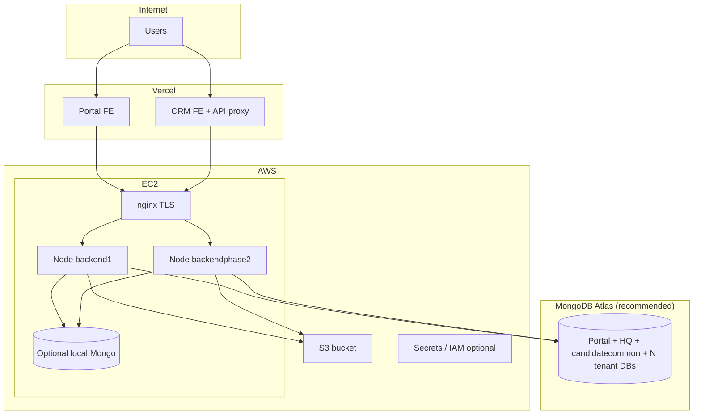

# Architecture Diagrams — Phase 1 & Phase 2

**Product:** HRYantra  
**Last updated:** 2026-09-17  

---

## 1. Integrated system (high level)



---

## 2. Phase 1 — Candidate Job Portal

### 2.1 Logical architecture

```mermaid
flowchart LR
  subgraph FE["jobportal_himanshu (Next.js 16)"]
    WEB[Marketing / auth]
    PROF[Profile & CV]
    JOBS[Jobs & applications]
    LMS[LMS / tokens]
  end

  subgraph BE["backend1 (Express)"]
    AUTH[/api/auth OTP + JWT]
    PROFILE[/profile /cv]
    APPS[/applications]
    INT[/internal sync]
  end

  FE --> BE
  BE --> M[(Portal Mongo)]
  BE --> S3[(S3 phase1/)]
  BE --> CC[(candidatecommon)]
  INT -->|x-phase2-portal-sync-secret<br/>tenantDbName| P2[Phase 2 API]
```

### 2.2 Component stack

| Layer | Technology |
|-------|------------|
| UI | Next.js App Router, React 19, Tailwind, TanStack Query, Zustand |
| API | Express, Prisma 5 → MongoDB |
| Auth | Email/WhatsApp OTP (Resend), JWT + Mongo `Session`, bcrypt passwords |
| Files | AWS S3 (`uploads/phase1/...`), multer memory limits |
| AI | Resume parse, ATS, job matching |
| Realtime | Socket.IO (interview rooms) |

### 2.3 Request path (production)

```text
Browser → Vercel (portal)
       → api1.hryantra.com (nginx)
       → backend1 :5000
       → Mongo (portal) + S3 + optional Phase 2 sync
```

### 2.4 Key domains

- Auth / sessions / OTP  
- Candidate profile (personal, work, education, visa, vaccination, prefs, …)  
- CV upload, parse, editor, ATS  
- Jobs & applications (including mirrored CRM jobs)  
- Matching pipeline & notifications  
- LMS, mock interview, token wallet  
- HQ admin surfaces on portal  

---

## 3. Phase 2 — Employer CRM

### 3.1 Logical architecture



### 3.2 Component stack

| Layer | Technology |
|-------|------------|
| UI | Next.js 15, React 18, Tailwind, MUI, SWR, Socket.IO client |
| API | Express, Prisma → MongoDB (DB per tenant) |
| Auth | Login JWT (access + refresh), session gate, SystemRole permissions |
| Tenancy | `AsyncLocalStorage` + Prisma URL rewrite per `tenantDbName` |
| Files | S3 + authenticated entity files + PDF/resume proxies |
| Public share | Client-review JWT / short code (≈14 days), URL masking |

### 3.3 Client-review flow



### 3.4 Request path (production)

```text
Browser → Vercel (employers)
       → /api/proxy → api2.hryantra.com (nginx)
       → backendphase2 :5001 (PM2)
       → Tenant Mongo DB + S3 + integrations
```

---

## 4. Deployment topology



---

## 5. Trust boundaries

| Boundary | Mechanism |
|----------|-----------|
| Candidate ↔ Portal | JWT + session row; OTP for login |
| Recruiter ↔ CRM | JWT + RBAC permissions; optional single active session |
| Portal ↔ CRM | Shared `PHASE2_PORTAL_SYNC_SECRET` header |
| Tenant ↔ Tenant | Separate Mongo database per tenant |
| Client review ↔ CRM data | Time-limited token; storage URLs rewritten to API proxy |
| Browser ↔ S3 | Prefer proxied resume/file routes; avoid exposing long-lived bucket URLs |

---

## 6. Related source anchors

| Concern | Path |
|---------|------|
| Phase 1 server mounts | `backend1/src/server.js` |
| Phase 2 app mounts | `backendphase2/src/app.js` |
| Tenant Prisma context | `backendphase2/src/config/prisma.js` |
| Tenant middleware | `backendphase2/src/middleware/tenant-context.middleware.js` |
| Client-review serialize | `backendphase2/src/services/interview.service.js` |
| FE proxy | `frontphase2/src/app/api/proxy/[...path]/route.ts` |
| Threat model | `docs/PRODUCTION_SECURITY_THREAT_MODEL.md` |
