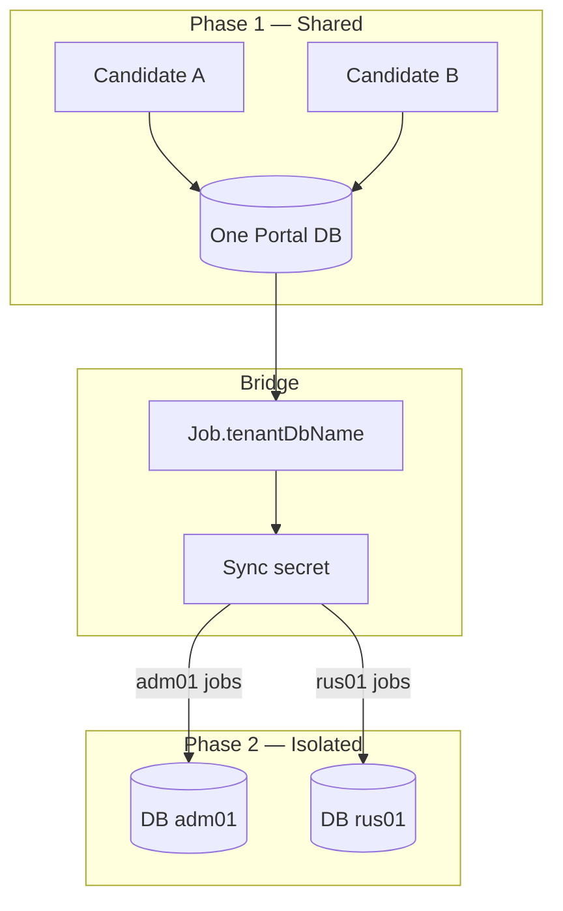

# Multi-Tenancy Model — Phase 1 & Phase 2

**Product:** HRYantra  
**Last updated:** 2026-09-17  

---

## 1. Executive summary

| System | Tenancy model |
|--------|----------------|
| **Phase 1 — Candidate portal** | **Single shared application database.** Multi-agency context appears only as metadata (`Job.tenantDbName`) when syncing into Phase 2. |
| **Phase 2 — Employer CRM** | **Database-per-tenant.** Each agency/employer org gets its own MongoDB database. Prisma connection URL is rewritten per request via AsyncLocalStorage. |

Isolation guarantee for enterprise customers lives in **Phase 2**. Phase 1 is a shared candidate-facing platform that *feeds* tenant DBs.

---

## 2. Phase 2 — Database-per-tenant

### 2.1 Physical isolation

```text
HEADQUARTERS_DATABASE_URL  →  HQ control plane
DATABASE_URL / base Mongo   →  used to derive tenant URLs
tenant "adm01"              →  mongodb://…/adm01
tenant "rus01"              →  mongodb://…/rus01
…
CANDIDATE_COMMON_DATABASE_URL → shared pool (not a customer tenant)
JOB_PORTAL_DATABASE_URL       → Phase 1 portal (cross-system)
```

Implementation: `backendphase2/src/config/prisma.js`  
- `buildTenantDatabaseUrl(tenantDbName)` replaces the URL pathname with `/{tenantDbName}`.  
- `runWithTenantContext(tenantDbName, fn)` stores the name in `AsyncLocalStorage`.  
- Module code uses the ALS-scoped Prisma client so queries never accidentally hit another tenant’s DB.

### 2.2 Tenant resolution order

From `tenant-context.middleware.js` (typical order):

1. JWT claim `tenantDbName` / org binding (preferred for authenticated CRM users)  
2. Header `x-tenant-db-name` (internal / carefully controlled)  
3. Query / body fallbacks (restrict in hardened production)

**Rule for customer audits:** authenticated recruiter traffic must resolve tenant from the **signed JWT**, not from a client-supplied header alone.

### 2.3 What is isolated vs shared

| Resource | Isolated per tenant? |
|----------|----------------------|
| Candidates, clients, jobs, pipelines, interviews, placements, billing | **Yes** (tenant Mongo DB) |
| Roles / users within org | **Yes** |
| S3 objects | **Logical** (path prefixes / ownership metadata); bucket may be shared |
| Headquarters registry | Shared control plane |
| `candidatecommon` | Shared pool with candidate IDs; not a substitute for tenant isolation |
| Frontend CDN / Vercel | Shared edge; auth separates users |

### 2.4 HQ & impersonation

HQ operators can provision, pause, and (where enabled) impersonate tenants. Impersonation must:

- Be audited  
- Carry explicit JWT flags  
- Never mix two tenant Prisma contexts in one request  

### 2.5 Behaviour analytics (not isolation)

`TenantBehaviorSnapshot` stores per-user UI/behaviour JSON **inside the tenant DB**. It is product analytics / ops intel, **not** the tenancy boundary.

---

## 3. Phase 1 — Shared portal + tenant tagging

### 3.1 Model

```text
All candidates → one Portal Mongo DB
Jobs mirrored from CRM → Job.tenantDbName = "adm01" (example)
Apply → Phase 2 internal sync with that tenantDbName + sync secret
```

### 3.2 Sync boundary

| Step | Detail |
|------|--------|
| Trigger | Apply / withdraw / profile sync paths |
| Auth | Header `x-phase2-portal-sync-secret` = `PHASE2_PORTAL_SYNC_SECRET` |
| Routing | Phase 2 opens the named tenant DB and upserts application / candidate |
| Fallback | `PHASE2_DEFAULT_TENANT_DB_NAME` for legacy jobs missing a tag |

### 3.3 Candidate common pool

`candidatecommon` holds denormalized snapshots so Phase 2 tenants can attach `source: 'phase1'` candidates without re-entering CVs. Access from CRM remains tenant-scoped for *operational* candidate records after import.

---

## 4. Cross-tenant attack surface (controls)

| Risk | Control |
|------|---------|
| JWT from tenant A used against tenant B | Token embeds tenant; middleware selects that DB only |
| Header spoofing `x-tenant-db-name` | Prefer JWT-only resolution in production; deny anonymous header switch |
| Shared S3 bucket listing | Private bucket; IAM least privilege; proxy downloads |
| Client-review token from A opens B | Token embeds interview/match/tenant; resume routes scoped to that token |
| Portal sync writing wrong tenant | Jobs must carry correct `tenantDbName`; secret required |
| HQ open setup routes | Disable `/hq/setup` in production (threat model) |

---

## 5. Onboarding a new tenant (Phase 2)

Typical flow:

1. HQ creates org + allocates `tenantDbName` (e.g. `adm01`).  
2. Provision empty Mongo database (migrate Prisma schema).  
3. Seed system roles / first admin user.  
4. Configure billing / subscription as needed.  
5. Issue login; JWT thereafter pins all traffic to that DB.

---

## 6. Comparison diagram



---

## 7. Customer FAQ

**Q: Can Agency X see Agency Y’s candidates?**  
**A:** Not via normal CRM APIs. Data lives in separate Mongo databases. Shared pools (`candidatecommon`) are infrastructure bridges, not cross-agency CRM UIs.

**Q: Where does my data live?**  
**A:** Phase 2 tenant database named for your org (e.g. `adm01`), plus your objects under the application S3 folder. Confirm region with ops (Atlas / AWS region).

**Q: How is client review isolated?**  
**A:** Time-limited token scoped to specific interview/match/tenant; presentation field visibility; storage URLs masked through token-bound proxies.

---

## 8. Source anchors

| Topic | Path |
|-------|------|
| Prisma tenant URL + ALS | `backendphase2/src/config/prisma.js` |
| Tenant middleware | `backendphase2/src/middleware/tenant-context.middleware.js` |
| HQ tenant ops | `backendphase2/src/modules/hq/` |
| Portal sync | `backendphase2` internal portal-sync routes; Phase 1 applications sync |
| Job tenant field | Phase 1 `Job.tenantDbName` (Prisma schema / sync services) |
